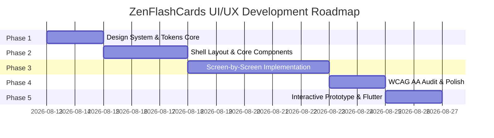

# 🗺️ DETAILED UI/UX IMPLEMENTATION PLAN — ZENFLASHCARDS

> **Design Standard**: `Zen Style` (Dark, Calm, Focused) | `/ui-ux-pro-max` | `/ui-a11y` (WCAG AA) | Inter Typography
> **Source Document**: [`Plan_UI/plan_UI-UX.md`](file:///C:/Users/Admin/Documents/code_workspace/app-mobile/Plan_UI/plan_UI-UX.md)
> **Last Updated**: 2026-08-13

---

## 📌 OVERALL OBJECTIVES

Organize the User Interface (UI) and User Experience (UX) development process for **ZenFlashCards** into 5 coherent phases, ensuring:
1. **Standardized Design**: Minimalist, distraction-free, using Dark Navy `#0F172A`, Surface `#1E293B`, and Indigo `#4F46E5` color tones.
2. **Accessibility (WCAG AA)**: Standard contrast ratio (`#A0AEC0` for 11sp captions), dual visual cues (Color + Icon ✓/✗) for color blindness, touch target ≥ 48dp.
3. **Smooth Micro-interactions**: 400ms 3D card flip, rating buttons dimming/lighting up based on card state, count-up animation for Stats & Score ring.

---

## 🗓️ 5-PHASE ROADMAP BREAKDOWN

---

## 🎨 PHASE 1: BUILD DESIGN SYSTEM & TOKENS FOUNDATION

### 1.1. Color Tokens System
* **Dark Mode (Default)**:
  - `bg_main`: `#0F172A` (Very dark Navy)
  - `bg_surface`: `#1E293B` (Navy for cards & bottom bar)
  - `primary_accent`: `#4F46E5` (Indigo)
  - `primary_light`: `#818CF8` (Light Indigo)
  - `text_primary`: `#F8FAFC` (White)
  - `text_secondary`: `#94A3B8` (Blue-gray)
  - `text_caption`: `#A0AEC0` (WCAG AA Pass for 11sp)
  - `divider`: `#2D3748`
  - `rating_hard`: `#EF4444` (Red)
  - `rating_ok`: `#F59E0B` (Yellow/Orange)
  - `rating_easy`: `#22C55E` (Green)
  - `streak_fire`: `#F97316` (Orange)
* **Light Mode (Support)**:
  - `bg_main`: `#F8FAFC` | `bg_surface`: `#FFFFFF` | `text_primary`: `#0F172A` | `primary_accent`: `#4F46E5`

### 1.2. Typography System (Inter Font Family)
- **Display**: 32sp, Weight 700 (Bold) — Vocabulary on the front of the flashcard
- **Headline**: 20sp, Weight 600 (SemiBold) — Deck name, screen titles
- **Title**: 16sp, Weight 600 (SemiBold) — Card name in the list
- **Body**: 14sp, Weight 400 (Regular) — Descriptions, subtitles
- **Label**: 12sp, Weight 500 (Medium) — Language tags, badges
- **Caption**: 11sp, Weight 400 (Regular) — Small metadata (`#A0AEC0`, WCAG AA Contrast ≥ 4.5:1)

### 1.3. Shape, Elevation & Spacing Tokens
- **Border Radius**: `24dp` (Flashcard), `16dp` (DeckCard), `12dp` (Button/Quiz Choice), `8dp` (List item)
- **Screen Padding**: `20dp` horizontal
- **Item Spacing**: `12dp`
- **Minimum Touch Target**: `48dp x 48dp` (Ensures users can tap easily without missing)
- **Shadow**: `0 2px 8px rgba(0,0,0,0.3)` (Card), `0 4px 16px rgba(0,0,0,0.4)` (Flashcard)

---

## 🧱 PHASE 2: COMMON LAYOUT SHELL & CORE COMPONENTS DESIGN

### 2.1. Base Scaffold & Navigation Shell
- **TopAppBar Component**:
  - Top of the screen, transparent background, Inter SemiBold 20sp title.
  - Supports Back button `←`, Title, Subtitle, Action Menu (`⋮`).
- **Custom Bottom Navigation Bar**:
  - 3 Tabs: 🏠 Home | 📊 Stats | ⚙️ Settings
  - Active icon: Indigo filled `#4F46E5`, Inactive icon: Gray `#94A3B8`.
  - Minimalist design with no text labels, 64dp height, background `#1E293B`.

### 2.2. Core Components Library
1. `DeckCard`: Surface `#1E293B`, `borderRadius: 16dp`, 🇬🇧 🇻🇳 flag info, cards due badge (indigo) or green tick ✅ when completed. Long-press opens context menu.
2. `ZenButton`: Custom button supporting 3 variants (Filled Indigo, Outlined, Text), tap scale feedback animation `0.95` over 100ms.
3. `ProgressBar`: Thin `4dp` indigo progress bar running smoothly under the AppBar for Study & Quiz.
4. `EmptyState`: Simple 📚 illustration + centered gray message text when the deck is empty.

---

## 📱 PHASE 3: DETAILED DESIGN OF 7 MAIN SCREENS

### Screen 1 — Home (Deck List)
- **TopAppBar**: "ZenFlashCards" title, filter/search icon (optional v2).
- **Body**: Vertically scrollable list of `DeckCard`s.
  - Incomplete decks: Indigo circular badge showing the number of cards due today.
  - Completed decks: Small green tick ✅ (badge is not hidden to maintain positive feedback).
- **FAB**: Round Indigo `+` button positioned at the bottom-right.
- **Bottom Nav**: Fixed at the bottom of the screen.

### Screen 2 — Deck Detail
- **TopAppBar**: Back button, deck name Title, Subtitle "English → Vietnamese · 39 cards", 3-dot menu.
- **Sticky Action Row**: 3 horizontal buttons of equal height:
  - `Study Now` (Filled Indigo 📚) — Disabled displaying "Reviewed today ✓" if 0 due cards.
  - `Quiz` (Outlined Indigo 🎯)
  - `Import CSV` (Text Button 📥 gray)
- **Card List**: Row with front (bold) — `→` — back (gray), thin divider, swipe actions for Edit / Delete.
- **FAB**: `+` button to add a new card.

### Screen 3 — Study / Flashcard Flip
- **TopAppBar**: `X` exit button on the left, `3 / 12` progress on the right, 4dp indigo progress bar below.
- **Card Area (60% Height)**:
  - Surface `#1E293B`, `borderRadius: 24dp`, elevated shadow.
  - Front side: "ENGLISH" tag `#94A3B8`, 32sp Display vocabulary text centered in white.
  - Tap card ➔ 400ms Y-axis 3D flip animation (`easeInOut`) ➔ Back side: 28sp definition + example sentence `#CBD5E1`.
- **Rating Area (3 Pill Buttons)**:
  - `😅 Hard` (Dim red `#EF4444`), `😊 OK` (Dim yellow `#F59E0B`), `😎 Easy` (Dim green `#22C55E`).
  - Before flipping: `opacity: 0.3`, `pointerEvents: none` (dimmed + disabled, but not hidden to prevent layout shifting).
  - Selecting a button ➔ Card slides up slightly and loads the next card.

### Screen 4 — Quiz (Multiple Choice)
- **TopAppBar**: "Quiz", "4/10" progress, indigo progress bar.
- **Question Card**: 24sp bold white Headline `#F8FAFC`, "Select the correct meaning" tag.
- **4 Choices (Vertical Stack)**:
  - Border `#2D3748`, background `#1E293B`, 12dp radius.
  - **Correct answer**: Dim green `#22C55E` background flash + **✓** icon on the right (WCAG colorblind accessible).
  - **Wrong answer**: Dim red `#EF4444` background flash + **✗** icon on the right + Automatically highlights the correct answer in green **✓**.
  - Auto-advances to the next question after 1.2s.

### Screen 5 — Session Result
- **Score Ring**: ~200dp circular ring, indigo fill animates based on %. Large `8/10` number in the center.
- **Motivational Message**: ≥80% "Excellent! 🎉" | 50–79% "Good job! 💪" | <50% "Keep it up! 🌱".
- **Stats Row**: `✅ Correct: 8` green — `❌ Incorrect: 2` red.
- **Actions**: `Review Again` (Outlined indigo) & `Done` (Filled indigo).

### Screen 6 — Stats
- **Streak Card**: Prominent first card, subtle indigo gradient (`#3730A3` ➔ `#4F46E5`), 🔥 icon + "7 day streak".
- **Bar Chart (7 Days)**: Indigo columns proportional to the number of cards studied; today's column is brighter with a border.
- **Donut Chart (Rating Distribution)**: 3 segments Easy (Green) / OK (Yellow) / Hard (Red), % legend below.
- **Summary Row**: "Total decks: 5" | "Total cards: 180".

### Screen 7 — Settings
- **Interface**: Chip selector for ☀️ Light / 🌙 Dark / 🤖 System themes.
- **Information**: Version "1.0.0", Feedback / Report a bug, About ZenFlashCards.

---

## ♿ PHASE 4: ACCESSIBILITY TESTING (WCAG AA), POLISH & ANIMATION TUNING

### 4.1. Color Contrast Ratio Audit
- Check `text_primary` (`#F8FAFC`) against `bg_surface` (`#1E293B`): Ratio **13.8:1** (Passes WCAG AAA).
- Check `text_caption` (`#A0AEC0`) against `bg_surface` (`#1E293B`): Ratio **5.2:1** (Passes WCAG AA for 11sp).
- Check `primary_accent` (`#4F46E5`) against `bg_main` (`#0F172A`): Ratio **4.8:1** (Passes WCAG AA).

### 4.2. Color Blindness Support Audit
- Quiz Screen: Ensure not only green/red colors are used, but always accompany them with **✓** and **✗** Icons.
- Study Screen: The 3 Rating buttons are accompanied by visual Emojis (😅 Hard / 😊 OK / 😎 Easy) + clear text labels.

### 4.3. Optimize Touch Targets & Performance
- Minimum touch area of `48dp x 48dp` for all icon buttons, nav tabs, and list actions.
- Ensure smooth 60fps/120fps performance for the 3D card flip effect (Impeller / Custom Painter).

---

## 🚀 PHASE 5: CREATE INTERACTIVE PROTOTYPE & INITIALIZE FLUTTER UI CODE

### 5.1. Interactive Web Prototype (For UI preview & testing)
- Build an Interactive Prototype using HTML5/CSS3/Vanilla JS at `prototype/index.html`.
- Allow direct interaction across all 7 screens, click to flip 3D cards, select quiz answers with ✓/✗ feedback, and view Stats charts.

### 5.2. Clean Architecture Flutter UI Code Structure (`lib/presentation/`)
- Organize the folder structure according to the architecture plan:
  - `lib/presentation/theme/app_theme.dart` (Theme & Color Tokens)
  - `lib/presentation/components/` (DeckCard, ZenButton, FlipCard, RatingBar, ScoreRing)
  - `lib/presentation/screens/home/`
  - `lib/presentation/screens/deck_detail/`
  - `lib/presentation/screens/study/`
  - `lib/presentation/screens/quiz/`
  - `lib/presentation/screens/result/`
  - `lib/presentation/screens/stats/`
  - `lib/presentation/screens/settings/`

---

## ✅ DEFINITION OF DONE FOR UI/UX

- [ ] All 7 screens match 100% in layout, color, and typography as per `plan_UI-UX.md`.
- [ ] Study screen features a smooth 400ms 3D card flip, rating buttons dim to 0.3 before flipping.
- [ ] Quiz screen provides dual visual feedback (Color + Icon ✓/✗) for WCAG AA compliance.
- [ ] Stats screen correctly displays the subtle Streak Card gradient & both chart types (Bar + Donut).
- [ ] Verified 0 contrast errors or touch targets smaller than 48dp.
