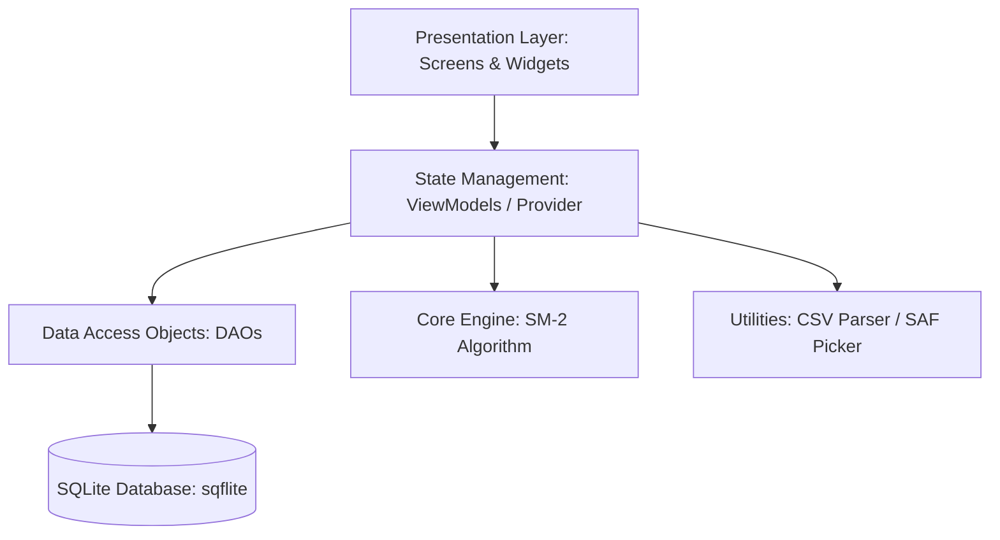
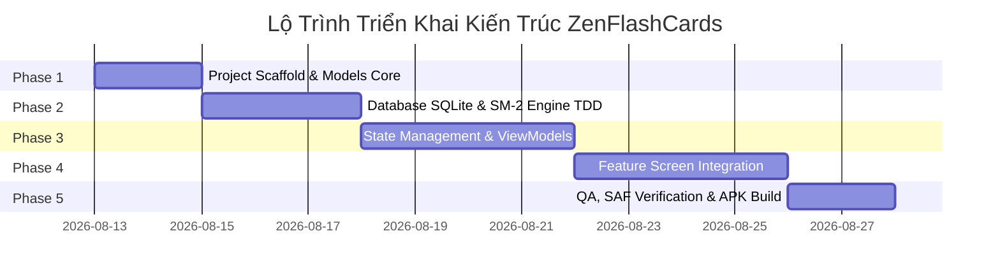

# 🏗️ KẾ HOẠCH BẢN NGHĨA KIẾN TRÚC & TRIỂN KHAI CODE — ZENFLASHCARDS

> **Vai trò**: `/senior-architect` & `/flutter-expert`
> **Tài liệu gốc**: [`Plan_arch/plan_architect.md`](file:///C:/Users/Admin/Documents/code_workspace/app-mobile/Plan_arch/plan_architect.md)
> **Môi trường**: Flutter 3.x (Dart 3.x) | SQLite (`sqflite`) | Provider | Android SAF
> **Cập nhật lần cuối**: 2026-08-13

---

## 📌 TỔNG QUAN HỆ THỐNG KIẾN TRÚC

Ứng dụng **ZenFlashCards** được thiết kế theo mô hình **Clean Architecture + Feature-Driven Structure** kết hợp với **Repository/DAO Pattern** và **Provider State Management**. Hệ thống lưu trữ dữ liệu offline 100% bằng SQLite, tích hợp thuật toán ghi nhớ Spaced Repetition (SM-2) và xử lý file CSV qua Storage Access Framework (SAF).



---

## 🗓️ BẢNG LỘ TRÌNH 5 GIAI ĐOẠN (ARCHITECTURAL PHASES)



---

## 📦 PHASE 1: KHỞI TẠO PROJECT SCAPFOLD, DEPENDENCIES & DATA MODELS

### 1.1. Cấu Trúc Dự Án (Clean Architecture + Feature-Driven)
Tạo cấu hình thư mục chuẩn như sau:

```
lib/
├── main.dart
├── app.dart                        # MaterialApp, ThemeData, ThemeResolver
├── core/
│   ├── database/
│   │   ├── database_helper.dart   # SQLite setup, migration, indexes
│   │   └── dao/
│   │       ├── deck_dao.dart
│   │       ├── card_dao.dart      # Query cards_due_today, card count
│   │       ├── study_log_dao.dart # Aggregate logs per session
│   │       └── review_history_dao.dart # Log quality on every flip
│   ├── models/
│   │   ├── deck.dart
│   │   ├── flashcard.dart
│   │   ├── study_log.dart
│   │   └── review_history.dart
│   ├── algorithms/
│   │   └── sm2.dart              # SM-2 Spaced Repetition Algorithm
│   └── utils/
│       ├── csv_parser.dart       # SAF Fallback Bytes Reader
│       └── constants.dart
├── features/
│   ├── home/                     # HomeScreen, HomeViewModel
│   ├── deck/                     # DeckList, DeckDetail, DeckForm, DeckViewModel
│   ├── card/                     # CardForm, CardViewModel
│   ├── study/                    # StudyScreen, QuizScreen, StudyViewModel
│   ├── stats/                    # StatsScreen, StatsViewModel
│   └── settings/                 # SettingsScreen, SettingsViewModel
└── shared/
    ├── widgets/                  # FlipCard3D, ProgressBar, EmptyState
    └── theme/                    # AppTheme, AppColors
```

### 1.2. Khai Báo Dependencies (`pubspec.yaml`)
- `sqflite: ^2.3.3+1` & `path: ^1.9.0` (Lưu trữ SQLite offline)
- `provider: ^6.1.2` (Quản lý trạng thái)
- `file_picker: ^8.1.2` (SAF file picker, no permission needed)
- `csv: ^6.0.0` (Parse CSV file)
- `fl_chart: ^0.69.0` (Bar chart & Donut chart cho Stats)
- `shared_preferences: ^2.3.2` (Lưu cấu hình ThemeMode)
- `uuid: ^4.4.2` & `intl: ^0.19.0` (Tạo ID & format ngày)
- `google_fonts: ^6.2.1` (Tải & nạp font Inter mượt mà)

### 1.3. Khởi Tạo Class Models
Xây dựng các Data Class kèm theo `toMap()` và `fromMap()`:
- `Deck` (id, name, description, languageFront, languageBack, createdAt)
- `Flashcard` (id, deckId, front, back, repetition, easiness, interval, nextReview, createdAt)
- `StudyLog` (id, deckId, cardsStudied, correct, studiedAt)
- `ReviewHistory` (id, cardId, deckId, quality, reviewedAt)

---

## 🗄️ PHASE 2: DATABASE LAYER & THUẬT TOÁN SM-2 (VỚI TDD UNIT TESTS)

### 2.1. Thiết Kế SQLite Database (`database_helper.dart`)
Tạo 4 bảng dữ liệu tối ưu với các **Index** truy vấn nhanh:

```sql
-- 1. Bảng decks (bỏ card_count denormalized, tính động qua COUNT(*))
CREATE TABLE decks (
  id TEXT PRIMARY KEY,
  name TEXT NOT NULL,
  description TEXT,
  language_front TEXT NOT NULL,
  language_back TEXT NOT NULL,
  created_at INTEGER NOT NULL
);

-- 2. Bảng flashcards
CREATE TABLE flashcards (
  id TEXT PRIMARY KEY,
  deck_id TEXT NOT NULL,
  front TEXT NOT NULL,
  back TEXT NOT NULL,
  repetition INTEGER DEFAULT 0,
  easiness REAL DEFAULT 2.5,
  interval INTEGER DEFAULT 1,
  next_review INTEGER NOT NULL, -- Unix timestamp ms (khởi tạo = now để hiện ngay)
  created_at INTEGER NOT NULL,
  FOREIGN KEY (deck_id) REFERENCES decks(id) ON DELETE CASCADE
);

CREATE INDEX idx_flashcards_deck ON flashcards(deck_id);
CREATE INDEX idx_flashcards_next_review ON flashcards(next_review);

-- 3. Bảng study_logs (lưu 1 row duy nhất khi kết thúc mỗi buổi học)
CREATE TABLE study_logs (
  id TEXT PRIMARY KEY,
  deck_id TEXT NOT NULL,
  cards_studied INTEGER NOT NULL,
  correct INTEGER NOT NULL,
  studied_at INTEGER NOT NULL
);

CREATE INDEX idx_study_logs_date ON study_logs(studied_at);

-- 4. Bảng review_history (lưu từng lượt lật card kèm quality 0/3/5)
CREATE TABLE review_history (
  id TEXT PRIMARY KEY,
  card_id TEXT NOT NULL,
  deck_id TEXT NOT NULL,
  quality INTEGER NOT NULL,
  reviewed_at INTEGER NOT NULL,
  FOREIGN KEY (card_id) REFERENCES flashcards(id) ON DELETE CASCADE
);

CREATE INDEX idx_review_history_card ON review_history(card_id);
CREATE INDEX idx_review_history_deck ON review_history(deck_id);
```

### 2.2. Xây Dựng Thuật Toán SM-2 (`sm2.dart`)
Triển khai thuật toán Spaced Repetition tiêu chuẩn Anki/SuperMemo 2:

```dart
class SM2Result {
  final int repetition;
  final double easiness;
  final int intervalDays;
  final int nextReviewMs;
  SM2Result({required this.repetition, required this.easiness, required this.intervalDays, required this.nextReviewMs});
}

SM2Result calculateNextReview({
  required int repetition,
  required double easiness,
  required int intervalDays,
  required int quality, // 0 = Khó, 3 = OK, 5 = Dễ
}) {
  int newRep = quality < 3 ? 0 : repetition + 1;
  int newInterval;
  if (newRep <= 1) {
    newInterval = 1;
  } else if (newRep == 2) {
    newInterval = 6;
  } else {
    newInterval = (intervalDays * easiness).round();
  }

  double newEasiness = easiness + (0.1 - (5 - quality) * (0.08 + (5 - quality) * 0.02));
  if (newEasiness < 1.3) newEasiness = 1.3; // Giới hạn dưới tối thiểu

  final nextMs = DateTime.now().add(Duration(days: newInterval)).millisecondsSinceEpoch;
  return SM2Result(repetition: newRep, easiness: newEasiness, intervalDays: newInterval, nextReviewMs: nextMs);
}
```

### 2.3. Bộ Unit Test TDD Cho Thuật Toán SM-2 (`test/core/algorithms/sm2_test.dart`)
Viết tự động các test case kiểm tra biên:
1. `quality < 3` ➔ Reset `repetition = 0` & `interval = 1`.
2. Lần ôn đúng thứ 1 ➔ `interval = 1` ngày.
3. Lần ôn đúng thứ 2 ➔ `interval = 6` ngày.
4. Lần ôn đạt điểm 5 ➔ `easiness` tăng cao hơn 2.5.
5. Giới hạn `easiness` không bao giờ giảm dưới 1.3.
6. `next_review` luôn nằm ở mốc thời gian tương lai.

---

## ⚡ PHASE 3: STATE MANAGEMENT (PROVIDER) & QUẢN LÝ NGHIỆP VỤ (VIEWMODELS)

### 3.1. `DeckViewModel`
- Quản lý danh sách Deck, CRUD Deck.
- Tính số lượng card động bằng SQL `COUNT(*)` từ `CardDao`.
- Tính tổng số card cần ôn trong ngày (`getTotalCardsDueToday()`) phục vụ badge ở Home.

### 3.2. `CardViewModel` & Safe CSV Parser (SAF Fallback)
- Xử lý cảnh báo trùng lặp mềm (`checkDuplicate()`).
- Đọc file CSV an toàn cho Android 13+ (Scoped Storage):
  ```dart
  Future<String> readCsvContent(PlatformFile file) async {
    if (file.path != null) {
      return await File(file.path!).readAsString();
    } else if (file.bytes != null) {
      return utf8.decode(file.bytes!); // Safe SAF Fallback
    } else {
      throw Exception('Không thể truy cập dữ liệu file CSV');
    }
  }
  ```
- Lọc bỏ các card trùng khớp hoàn toàn `front + back` khi import, thông báo chi tiết: *"Đã import X card, bỏ qua Y card trùng"*.

### 3.3. `StudyViewModel` & Review Queue Management
- Nạp danh sách cards due today (`next_review <= now`).
- Cập nhật SM-2 và ghi log vào `review_history` cho **mỗi lần lật card**.
- Kết thúc buổi học: Ghi duy nhất **1 row** vào `study_logs` chứa tổng số card đã học & số câu trả lời đúng (`quality >= 3`).

### 3.4. `StatsViewModel` & `SettingsViewModel`
- Tính toán Chuỗi Streak (số ngày liên tiếp có học).
- Tổng hợp dữ liệu cho Bar Chart (7 ngày gần nhất) và Donut Chart (tỉ lệ Khó / OK / Dễ).
- Lưu trữ và đồng bộ chế độ Theme (`ThemeMode.light`, `ThemeMode.dark`, `ThemeMode.system`) với `SharedPreferences`.

---

## 📱 PHASE 4: TÍCH HỢP GIAO DIỆN & CÁC TÍNH NĂNG FEATURE

### 4.1. Kết Nối UI & ViewModels (Provider Integration)
- Đăng ký các ViewModels ở đỉnh cây ứng dụng bằng `MultiProvider` trong `app.dart`.
- Tích hợp 7 màn hình tính năng đã chuẩn hóa ở Phase UI với các ViewModels tương ứng.

### 4.2. Xử Lý Cảnh Báo Trùng Lặp & Dynamic Action Buttons
- Hiện Dialog xác nhận khi người dùng cố tình thêm card có front + back trùng lặp.
- Disable nút "Học ngay" trên `DeckDetailScreen` với nhãn *"Đã ôn xong hôm nay ✓"* khi số card due = 0.

---

## 🧪 PHASE 5: TEST SUITE VERIFICATION, ANDROID SAF & RELEASE APK BUILD

### 5.1. Cấu Hình Android Manifest (`android/app/src/main/AndroidManifest.xml`)
- Xóa bỏ các khai báo permission storage thừa (`READ_EXTERNAL_STORAGE` / `READ_MEDIA_DOCUMENTS`) vì `file_picker` sử dụng SAF (`Intent.ACTION_OPEN_DOCUMENT`) không đòi hỏi quyền storage trên Play Store.

### 5.2. Quy Trình Kiểm Thử & Verification Checklist
1. Thao tác chạy Unit Test: `flutter test`.
2. Kiểm tra tĩnh mã nguồn: `flutter analyze`.
3. Kiểm tra thực tế:
   - [ ] Tạo deck ➔ Thêm card ➔ Card xuất hiện ngay (`next_review = now`).
   - [ ] Đọc file CSV bằng SAF trên Android 13+ không phát sinh lỗi bytes null.
   - [ ] Thuật toán SM-2 cập nhật ngày ôn tiếp theo đúng tỷ lệ theo lựa chọn Khó/OK/Dễ.
   - [ ] Kết thúc buổi học ➔ `study_logs` ghi nhận đúng 1 dòng dữ liệu.
   - [ ] Biểu đồ Bar Chart và Pie Chart hiển thị chính xác theo thống kê thực tế.
   - [ ] Thay đổi ThemeMode hệ thống ➔ App tự động thích ứng mượt mà.
4. Lệnh đóng gói APK Debug: `flutter build apk --debug`.

---

## ✅ CHECKLIST HOÀN THÀNH KIẾN TRÚC (DEFINITION OF DONE)

- [ ] Cấu trúc thư mục Clean Architecture hoạt động độc lập, tách biệt rõ ràng UI - Domain - Data.
- [ ] SQLite Database khởi tạo thành công 4 bảng và đầy đủ Indexes.
- [ ] Thuật toán SM-2 pass 100% các unit test cases trong `sm2_test.dart`.
- [ ] Xử lý file CSV đọc được cả path và bytes fallback cho Android 13+ SAF.
- [ ] Không có memory leak trên `AnimationController` hoặc `StreamController`.
