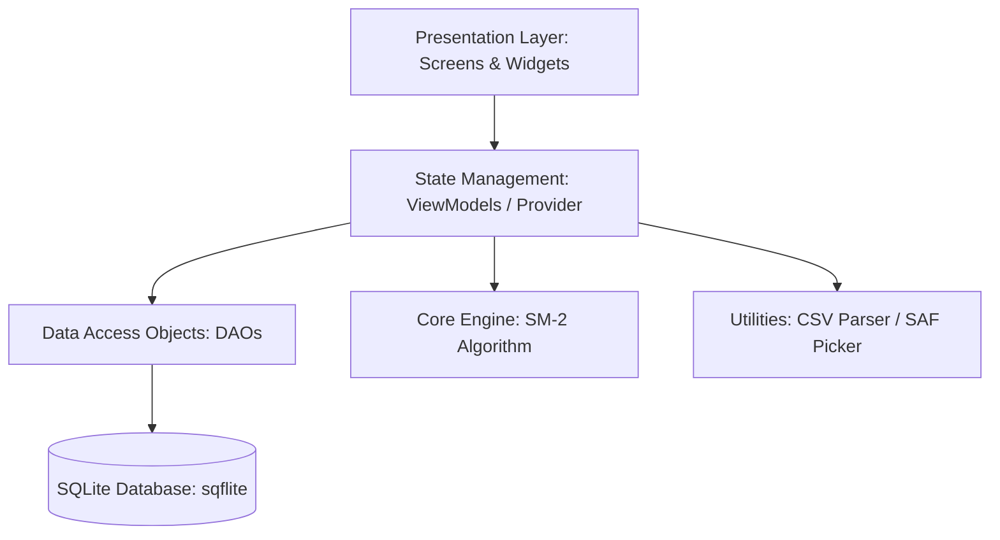
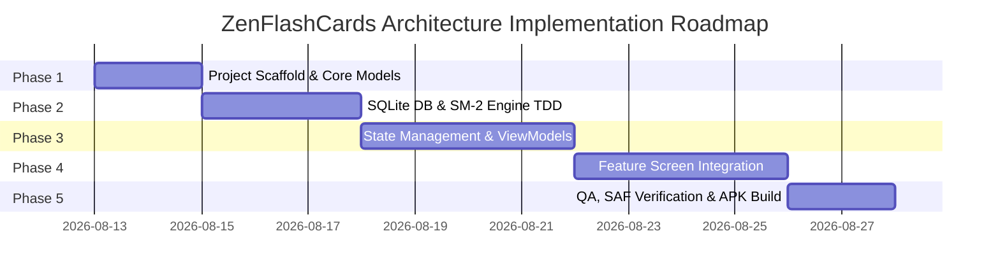

# 🏗️ ARCHITECTURAL DESIGN & IMPLEMENTATION PLAN — ZENFLASHCARDS

> **Role**: `/senior-architect` & `/flutter-expert`
> **Original Document**: [`Plan_arch/plan_architect.md`](file:///C:/Users/Admin/Documents/code_workspace/app-mobile/Plan_arch/plan_architect.md)
> **Environment**: Flutter 3.x (Dart 3.x) | SQLite (`sqflite`) | Provider | Android SAF
> **Last Updated**: 2026-08-13

---

## 📌 SYSTEM ARCHITECTURE OVERVIEW

The **ZenFlashCards** application is designed following a **Clean Architecture + Feature-Driven Structure**, combined with **Repository/DAO Pattern** and **Provider State Management**. The system relies on 100% offline data storage using SQLite, integrates the Spaced Repetition (SM-2) algorithm, and handles CSV files via the Storage Access Framework (SAF).



---

## 🗓️ 5-PHASE ROADMAP (ARCHITECTURAL PHASES)



---

## 📦 PHASE 1: PROJECT SCAFFOLD, DEPENDENCIES & DATA MODELS

### 1.1. Project Structure (Clean Architecture + Feature-Driven)
Create standard folder structure as follows:

```text
lib/
├── main.dart
├── app.dart                        # MaterialApp, ThemeData, ThemeResolver
├── core/
│   ├── database/
│   │   ├── database_helper.dart   # SQLite setup, migration, indexes
│   │   └── dao/
│   │       ├── deck_dao.dart
│   │       ├── card_dao.dart      # Query cards_due_today, card count
│   │       ├── study_log_dao.dart # Aggregate logs per session
│   │       └── review_history_dao.dart # Log quality on every flip
│   ├── models/
│   │   ├── deck.dart
│   │   ├── flashcard.dart
│   │   ├── study_log.dart
│   │   └── review_history.dart
│   ├── algorithms/
│   │   └── sm2.dart              # SM-2 Spaced Repetition Algorithm
│   └── utils/
│       ├── csv_parser.dart       # SAF Fallback Bytes Reader
│       └── constants.dart
├── features/
│   ├── home/                     # HomeScreen, HomeViewModel
│   ├── deck/                     # DeckList, DeckDetail, DeckForm, DeckViewModel
│   ├── card/                     # CardForm, CardViewModel
│   ├── study/                    # StudyScreen, QuizScreen, StudyViewModel
│   ├── stats/                    # StatsScreen, StatsViewModel
│   └── settings/                 # SettingsScreen, SettingsViewModel
└── shared/
    ├── widgets/                  # FlipCard3D, ProgressBar, EmptyState
    └── theme/                    # AppTheme, AppColors
```

### 1.2. Dependencies Declaration (`pubspec.yaml`)
- `sqflite: ^2.3.3+1` & `path: ^1.9.0` (Offline SQLite storage)
- `provider: ^6.1.2` (State management)
- `file_picker: ^8.1.2` (SAF file picker, no permission needed)
- `csv: ^6.0.0` (CSV parser)
- `fl_chart: ^0.69.0` (Bar chart & Donut chart for Stats)
- `shared_preferences: ^2.3.2` (Store ThemeMode configuration)
- `uuid: ^4.4.2` & `intl: ^0.19.0` (Generate IDs & format dates)
- `google_fonts: ^6.2.1` (Smoothly load Inter font)

### 1.3. Initialize Model Classes
Build Data Classes with `toMap()` and `fromMap()` methods:
- `Deck` (id, name, description, languageFront, languageBack, createdAt)
- `Flashcard` (id, deckId, front, back, repetition, easiness, interval, nextReview, createdAt)
- `StudyLog` (id, deckId, cardsStudied, correct, studiedAt)
- `ReviewHistory` (id, cardId, deckId, quality, reviewedAt)

---

## 🗄️ PHASE 2: DATABASE LAYER & SM-2 ALGORITHM (WITH TDD UNIT TESTS)

### 2.1. SQLite Database Design (`database_helper.dart`)
Create 4 optimized data tables with **Indexes** for fast querying:

```sql
-- 1. decks table (removed denormalized card_count, calculated dynamically via COUNT(*))
CREATE TABLE decks (
  id TEXT PRIMARY KEY,
  name TEXT NOT NULL,
  description TEXT,
  language_front TEXT NOT NULL,
  language_back TEXT NOT NULL,
  created_at INTEGER NOT NULL
);

-- 2. flashcards table
CREATE TABLE flashcards (
  id TEXT PRIMARY KEY,
  deck_id TEXT NOT NULL,
  front TEXT NOT NULL,
  back TEXT NOT NULL,
  repetition INTEGER DEFAULT 0,
  easiness REAL DEFAULT 2.5,
  interval INTEGER DEFAULT 1,
  next_review INTEGER NOT NULL, -- Unix timestamp ms (init = now for immediate display)
  created_at INTEGER NOT NULL,
  FOREIGN KEY (deck_id) REFERENCES decks(id) ON DELETE CASCADE
);

CREATE INDEX idx_flashcards_deck ON flashcards(deck_id);
CREATE INDEX idx_flashcards_next_review ON flashcards(next_review);

-- 3. study_logs table (save only 1 row at the end of each study session)
CREATE TABLE study_logs (
  id TEXT PRIMARY KEY,
  deck_id TEXT NOT NULL,
  cards_studied INTEGER NOT NULL,
  correct INTEGER NOT NULL,
  studied_at INTEGER NOT NULL
);

CREATE INDEX idx_study_logs_date ON study_logs(studied_at);

-- 4. review_history table (log every card flip with quality 0/3/5)
CREATE TABLE review_history (
  id TEXT PRIMARY KEY,
  card_id TEXT NOT NULL,
  deck_id TEXT NOT NULL,
  quality INTEGER NOT NULL,
  reviewed_at INTEGER NOT NULL,
  FOREIGN KEY (card_id) REFERENCES flashcards(id) ON DELETE CASCADE
);

CREATE INDEX idx_review_history_card ON review_history(card_id);
CREATE INDEX idx_review_history_deck ON review_history(deck_id);
```

### 2.2. Implement SM-2 Algorithm (`sm2.dart`)
Implement the standard Anki/SuperMemo 2 Spaced Repetition algorithm:

```dart
class SM2Result {
  final int repetition;
  final double easiness;
  final int intervalDays;
  final int nextReviewMs;
  SM2Result({required this.repetition, required this.easiness, required this.intervalDays, required this.nextReviewMs});
}

SM2Result calculateNextReview({
  required int repetition,
  required double easiness,
  required int intervalDays,
  required int quality, // 0 = Hard, 3 = OK, 5 = Easy
}) {
  int newRep = quality < 3 ? 0 : repetition + 1;
  int newInterval;
  if (newRep <= 1) {
    newInterval = 1;
  } else if (newRep == 2) {
    newInterval = 6;
  } else {
    newInterval = (intervalDays * easiness).round();
  }

  double newEasiness = easiness + (0.1 - (5 - quality) * (0.08 + (5 - quality) * 0.02));
  if (newEasiness < 1.3) newEasiness = 1.3; // Minimum lower bound

  final nextMs = DateTime.now().add(Duration(days: newInterval)).millisecondsSinceEpoch;
  return SM2Result(repetition: newRep, easiness: newEasiness, intervalDays: newInterval, nextReviewMs: nextMs);
}
```

### 2.3. TDD Unit Tests for SM-2 (`test/core/algorithms/sm2_test.dart`)
Write automated test cases to check boundaries:
1. `quality < 3` ➔ Reset `repetition = 0` & `interval = 1`.
2. First correct review ➔ `interval = 1` day.
3. Second correct review ➔ `interval = 6` days.
4. Review with score 5 ➔ `easiness` increases above 2.5.
5. `easiness` boundary never drops below 1.3.
6. `next_review` is always set to a future timestamp.

---

## ⚡ PHASE 3: STATE MANAGEMENT (PROVIDER) & BUSINESS LOGIC (VIEWMODELS)

### 3.1. `DeckViewModel`
- Manage Deck list, CRUD operations for Deck.
- Calculate dynamic card counts using SQL `COUNT(*)` via `CardDao`.
- Calculate total due cards across the day (`getTotalCardsDueToday()`) for the Home badge.

### 3.2. `CardViewModel` & Safe CSV Parser (SAF Fallback)
- Handle soft duplicate warnings (`checkDuplicate()`).
- Safely read CSV files for Android 13+ (Scoped Storage):
  ```dart
  Future<String> readCsvContent(PlatformFile file) async {
    if (file.path != null) {
      return await File(file.path!).readAsString();
    } else if (file.bytes != null) {
      return utf8.decode(file.bytes!); // Safe SAF Fallback
    } else {
      throw Exception('Cannot access CSV file data');
    }
  }
  ```
- Filter out fully duplicate `front + back` cards during import, showing detailed notifications: *"Imported X cards, skipped Y duplicate cards"*.

### 3.3. `StudyViewModel` & Review Queue Management
- Load list of cards due today (`next_review <= now`).
- Update SM-2 and write logs to `review_history` on **every card flip**.
- End of session: Write exactly **1 row** to `study_logs` containing total studied cards & correct answers (`quality >= 3`).

### 3.4. `StatsViewModel` & `SettingsViewModel`
- Calculate Streak sequence (consecutive study days).
- Aggregate data for Bar Chart (last 7 days) and Donut Chart (Hard / OK / Easy ratio).
- Store and synchronize ThemeMode (`ThemeMode.light`, `ThemeMode.dark`, `ThemeMode.system`) with `SharedPreferences`.

---

## 📱 PHASE 4: UI INTEGRATION & FEATURE IMPLEMENTATION

### 4.1. Connect UI & ViewModels (Provider Integration)
- Register ViewModels at the top of the widget tree using `MultiProvider` in `app.dart`.
- Integrate the 7 standardized feature screens (from the UI phase) with their respective ViewModels.

### 4.2. Handle Duplicate Warnings & Dynamic Action Buttons
- Show confirmation dialog when users intentionally add a card with a duplicate front + back.
- Disable the "Study Now" button on `DeckDetailScreen` with the label *"Done for today ✓"* when due cards = 0.

---

## 🧪 PHASE 5: TEST SUITE VERIFICATION, ANDROID SAF & RELEASE APK BUILD

### 5.1. Android Manifest Configuration (`android/app/src/main/AndroidManifest.xml`)
- Remove redundant storage permissions (`READ_EXTERNAL_STORAGE` / `READ_MEDIA_DOCUMENTS`) because `file_picker` uses SAF (`Intent.ACTION_OPEN_DOCUMENT`), which doesn't require storage permissions on the Play Store.

### 5.2. Testing Procedure & Verification Checklist
1. Run Unit Tests: `flutter test`.
2. Static code analysis: `flutter analyze`.
3. Practical verification:
   - [ ] Create deck ➔ Add card ➔ Card appears immediately (`next_review = now`).
   - [ ] Read CSV using SAF on Android 13+ without null bytes errors.
   - [ ] SM-2 algorithm correctly updates the next review date proportionally to the Hard/OK/Easy selection.
   - [ ] End study session ➔ `study_logs` correctly records exactly 1 data row.
   - [ ] Bar Chart and Pie Chart accurately display real statistics.
   - [ ] Change system ThemeMode ➔ App adapts smoothly automatically.
4. Build Debug APK command: `flutter build apk --debug`.

---

## ✅ ARCHITECTURE DEFINITION OF DONE (CHECKLIST)

- [ ] Clean Architecture folder structure functions independently with a clear separation of UI - Domain - Data.
- [ ] SQLite Database successfully initializes 4 tables with comprehensive Indexes.
- [ ] SM-2 algorithm passes 100% of unit test cases in `sm2_test.dart`.
- [ ] CSV file handling reads both path and fallback bytes for Android 13+ SAF.
- [ ] No memory leaks regarding `AnimationController` or `StreamController`.
