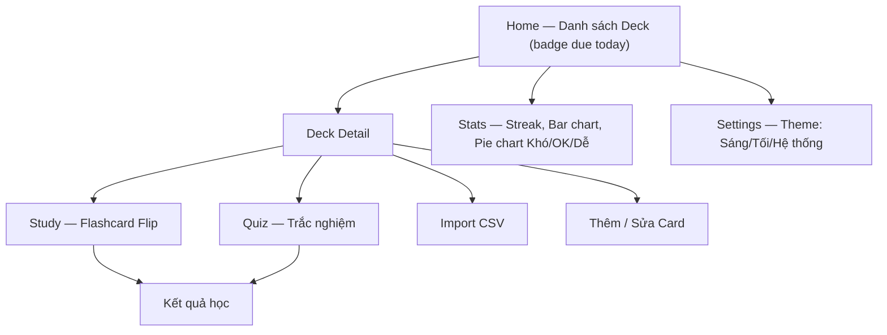

# 📱 ZenFlashCards — Flutter App

## Mô tả dự án

Xây dựng app Android **ZenFlashCards** — học từ vựng theo phương pháp Flashcard, dùng Flutter (Dart), lưu dữ liệu offline hoàn toàn bằng SQLite (thông qua `sqflite`). App hỗ trợ nhiều ngôn ngữ, thuật toán Spaced Repetition (SM-2), quiz, import CSV, thống kê, dark mode.

---

## User Review Required

> [!IMPORTANT]
> **Tên app**: **"ZenFlashCards"** ✅ (đã xác nhận)

> [!IMPORTANT]
> **Package name**: `com.example.zenflashcards` — nên đổi thành tên thật của bạn trước khi publish lên Play Store.

> [!IMPORTANT]
> **Bảng `review_history`**: Đã thêm vào schema để lưu từng lần review một card kèm quality. Điều này cho phép: pie chart breakdown theo Khó/OK/Dễ, và sau này dễ làm heatmap kiểu Anki. Trade-off: ghi thêm 1 row mỗi lần lật card — hoàn toàn chấp nhận được với SQLite offline.

---

## Open Questions

> [!IMPORTANT]
> Bạn đã bỏ chọn **Text-to-Speech** — tôi sẽ bỏ qua, nhưng để lại comment `// TODO: TTS hook` tại vị trí tích hợp sau này.

---

## Kiến trúc tổng quan

```
lib/
├── main.dart
├── app.dart                    # MaterialApp, ThemeData, routing
├── core/
│   ├── database/
│   │   ├── database_helper.dart   # SQLite setup, migrations, indexes
│   │   └── dao/
│   │       ├── deck_dao.dart
│   │       ├── card_dao.dart          # Gồm query cards_due_today
│   │       ├── study_log_dao.dart
│   │       └── review_history_dao.dart
│   ├── models/
│   │   ├── deck.dart
│   │   ├── flashcard.dart
│   │   ├── study_log.dart
│   │   └── review_history.dart
│   ├── algorithms/
│   │   └── sm2.dart              # Spaced Repetition SM-2 algorithm
│   └── utils/
│       ├── csv_parser.dart
│       └── constants.dart
├── features/
│   ├── home/
│   │   ├── home_screen.dart
│   │   └── home_viewmodel.dart
│   ├── deck/
│   │   ├── deck_list_screen.dart
│   │   ├── deck_detail_screen.dart
│   │   ├── deck_form_screen.dart
│   │   └── deck_viewmodel.dart
│   ├── card/
│   │   ├── card_list_screen.dart
│   │   ├── card_form_screen.dart
│   │   └── card_viewmodel.dart
│   ├── study/
│   │   ├── flashcard_study_screen.dart
│   │   ├── quiz_screen.dart
│   │   └── study_viewmodel.dart
│   ├── stats/
│   │   ├── stats_screen.dart
│   │   └── stats_viewmodel.dart
│   └── settings/
│       └── settings_screen.dart
└── shared/
    ├── widgets/
    │   ├── flip_card.dart
    │   ├── progress_bar.dart
    │   └── empty_state.dart
    └── theme/
        ├── app_theme.dart
        └── app_colors.dart
```

---

## Proposed Changes

### 1. Khởi tạo project Flutter

#### [NEW] Project scaffold

```bash
flutter create --org com.example --project-name zenflashcards zenflashcards
```

Thư mục gốc: `zenflashcards/`.

---

### 2. Dependencies (`pubspec.yaml`)

#### [MODIFY] pubspec.yaml

```yaml
dependencies:
  flutter:
    sdk: flutter

  # Database
  sqflite: ^2.3.3+1
  path: ^1.9.0

  # State management
  provider: ^6.1.2

  # File import (dùng SAF trên Android 13+ — không cần permission storage)
  file_picker: ^8.1.2

  # CSV parsing
  csv: ^6.0.0

  # Charts
  fl_chart: ^0.69.0

  # Shared preferences (theme mode)
  shared_preferences: ^2.3.2

  # UUID for IDs
  uuid: ^4.4.2

  # Intl (date formatting)
  intl: ^0.19.0

  # Font Inter qua Google Fonts — không cần bundle .ttf thủ công
  google_fonts: ^6.2.1

dev_dependencies:
  flutter_test:
    sdk: flutter
  flutter_lints: ^4.0.0
```

---

### 3. Database Layer

#### [NEW] `database_helper.dart`

Khởi tạo SQLite, **4 bảng**, **indexes** cho các cột query thường xuyên:

```sql
-- Deck: bộ thẻ (bỏ card_count — tính COUNT(*) khi cần, tránh lệch dữ liệu)
CREATE TABLE decks (
  id TEXT PRIMARY KEY,
  name TEXT NOT NULL,
  description TEXT,
  language_front TEXT NOT NULL,
  language_back TEXT NOT NULL,
  created_at INTEGER NOT NULL
);

-- Flashcard
CREATE TABLE flashcards (
  id TEXT PRIMARY KEY,
  deck_id TEXT NOT NULL,
  front TEXT NOT NULL,
  back TEXT NOT NULL,
  -- SM-2 fields
  repetition INTEGER DEFAULT 0,
  easiness REAL DEFAULT 2.5,
  interval INTEGER DEFAULT 1,
  next_review INTEGER NOT NULL,   -- unix ms; khởi tạo = now() → hiện ngay lần đầu
  created_at INTEGER NOT NULL,
  FOREIGN KEY (deck_id) REFERENCES decks(id) ON DELETE CASCADE
);

-- Index cho query cards theo deck và query "due today"
CREATE INDEX idx_flashcards_deck ON flashcards(deck_id);
CREATE INDEX idx_flashcards_next_review ON flashcards(next_review);

-- Study log: tổng hợp theo buổi học
CREATE TABLE study_logs (
  id TEXT PRIMARY KEY,
  deck_id TEXT NOT NULL,
  cards_studied INTEGER NOT NULL,
  correct INTEGER NOT NULL,
  studied_at INTEGER NOT NULL     -- unix ms, date portion dùng cho bar chart / streak
);

-- Index cho streak và bar chart 7 ngày (đều filter theo studied_at)
CREATE INDEX idx_study_logs_date ON study_logs(studied_at);

-- Review history: log từng lần review 1 card kèm quality
-- Dùng cho: pie chart Khó/OK/Dễ, heatmap kiểu Anki sau này
CREATE TABLE review_history (
  id TEXT PRIMARY KEY,
  card_id TEXT NOT NULL,
  deck_id TEXT NOT NULL,
  quality INTEGER NOT NULL,       -- 0=Khó, 3=OK, 5=Dễ (thang SM-2)
  reviewed_at INTEGER NOT NULL,
  FOREIGN KEY (card_id) REFERENCES flashcards(id) ON DELETE CASCADE
);

CREATE INDEX idx_review_history_card ON review_history(card_id);
CREATE INDEX idx_review_history_deck ON review_history(deck_id);
-- NOTE: index trên reviewed_at defer sang v2 — v1 pie chart chỉ SELECT theo deck_id,
-- chưa cần filter khoảng ngày. Thêm khi làm heatmap / date-range stats.
```

#### [NEW] `card_dao.dart` — Query cards due today

```dart
/// Lấy tất cả card trong deck cần ôn hôm nay (next_review <= now)
Future<List<Flashcard>> getCardsDueToday(String deckId) async {
  final db = await _db;
  final now = DateTime.now().millisecondsSinceEpoch;
  final rows = await db.query(
    'flashcards',
    where: 'deck_id = ? AND next_review <= ?',
    whereArgs: [deckId, now],
    orderBy: 'next_review ASC',
  );
  return rows.map(Flashcard.fromMap).toList();
}

/// Tổng số card due today across ALL decks — dùng cho Home badge
Future<int> getTotalCardsDueToday() async {
  final db = await _db;
  final now = DateTime.now().millisecondsSinceEpoch;
  final result = await db.rawQuery(
    'SELECT COUNT(*) as count FROM flashcards WHERE next_review <= ?',
    [now],
  );
  return Sqflite.firstIntValue(result) ?? 0;
}

/// Đếm số card trong deck (thay thế card_count denormalized)
Future<int> getCardCount(String deckId) async {
  final db = await _db;
  final result = await db.rawQuery(
    'SELECT COUNT(*) as count FROM flashcards WHERE deck_id = ?',
    [deckId],
  );
  return Sqflite.firstIntValue(result) ?? 0;
}
```

**Khởi tạo `next_review` cho card mới:**

```dart
// Trong card_dao.dart — insertCard()
final now = DateTime.now().millisecondsSinceEpoch;
final card = Flashcard(
  id: const Uuid().v4(),
  deckId: deckId,
  front: front,
  back: back,
  nextReview: now,  // ← next_review = now → hiện ngay trong lần ôn đầu tiên
  createdAt: now,
);
```

#### [NEW] `sm2.dart` — Thuật toán SM-2

```dart
/// SM-2 Spaced Repetition Algorithm
/// quality: 0=Blackout/Khó, 3=OK, 5=Perfect/Dễ
class SM2Result {
  final int repetition;
  final double easiness;
  final int intervalDays;
  final int nextReviewMs; // unix milliseconds
}

SM2Result calculateNextReview({
  required int repetition,
  required double easiness,
  required int intervalDays,
  required int quality, // 0–5
}) {
  // Nếu quality < 3: reset về đầu
  int newRep = quality < 3 ? 0 : repetition + 1;

  // Tính interval mới
  int newInterval;
  if (newRep <= 1) {
    newInterval = 1;
  } else if (newRep == 2) {
    newInterval = 6;
  } else {
    newInterval = (intervalDays * easiness).round();
  }

  // Cập nhật easiness factor
  double newEasiness = easiness + (0.1 - (5 - quality) * (0.08 + (5 - quality) * 0.02));
  if (newEasiness < 1.3) newEasiness = 1.3; // minimum EF

  final nextMs = DateTime.now()
      .add(Duration(days: newInterval))
      .millisecondsSinceEpoch;

  return SM2Result(
    repetition: newRep,
    easiness: newEasiness,
    intervalDays: newInterval,
    nextReviewMs: nextMs,
  );
}
```

---

### 4. Features

#### [NEW] Home Screen

- Grid/List các Deck đã tạo
- FAB để tạo Deck mới
- **Badge** tổng số card cần ôn hôm nay (query `getTotalCardsDueToday()`)
- Số card trong deck hiển thị bằng `getCardCount()` — không dùng `card_count` cột nữa

#### [NEW] Deck Detail Screen

- List các card trong deck
- Nút "Học ngay" → Study Screen (chỉ load cards due today)
- Nút "Quiz" → Quiz Screen
- Nút "Import CSV" → file picker (SAF, không cần declare permission)
- Nút "Thêm card" → Card Form

#### [NEW] Card Form — Soft warning khi trùng lặp

Không block user (người dùng có thể cố tình thêm 2 card giống nhau), nhưng hiện warning nhẹ:

```dart
// card_viewmodel.dart — checkDuplicate() gọi trước khi save
Future<bool> isDuplicate(String deckId, String front, String back) async {
  final existing = await cardDao.findByFrontBack(deckId, front.trim(), back.trim());
  return existing != null;
}

// card_form_screen.dart — trong onSave handler
if (await viewModel.isDuplicate(deckId, front, back)) {
  final confirmed = await showDialog<bool>(
    context: context,
    builder: (_) => AlertDialog(
      title: const Text('Card có thể bị trùng'),
      content: const Text('Đã có card với nội dung tương tự trong deck. Vẫn thêm?'),
      actions: [
        TextButton(onPressed: () => Navigator.pop(context, false), child: const Text('Hủy')),
        TextButton(onPressed: () => Navigator.pop(context, true),  child: const Text('Thêm anyway')),
      ],
    ),
  );
  if (confirmed != true) return; // user hủy
}
await viewModel.saveCard(deckId, front, back);
```

#### [NEW] CSV Import — Xử lý file picker + trùng lặp

**Vấn đề scoped storage**: Trên một số Android, `file_picker` trả về `PlatformFile.path == null` (SAF chỉ cấp bytes, không cấp path trực tiếp). Phải fallback sang `PlatformFile.bytes`:

```dart
// csv_parser.dart — đọc file an toàn
Future<String> _readCsvContent(PlatformFile file) async {
  if (file.path != null) {
    // Happy path: có path trực tiếp (Android <13 hoặc emulator)
    return await File(file.path!).readAsString();
  } else if (file.bytes != null) {
    // Fallback: SAF chỉ trả bytes (Android 13+ scoped storage)
    return utf8.decode(file.bytes!);
  } else {
    throw Exception('Không đọc được file — cả path lẫn bytes đều null');
  }
}

// file_picker call — luôn request withData: true để có bytes fallback
final result = await FilePicker.platform.pickFiles(
  type: FileType.custom,
  allowedExtensions: ['csv', 'txt'],
  withData: true,   // ← bắt buộc để có PlatformFile.bytes
);
```

**Xử lý trùng lặp:**

```dart
Future<ImportResult> importCsv(String deckId, PlatformFile file) async {
  final content = await _readCsvContent(file);
  final parsedRows = _parse(content); // auto-detect separator: , ; \t

  final existing = await cardDao.getAllCards(deckId);
  final existingPairs = existing.map((c) => '${c.front}|||${c.back}').toSet();

  int imported = 0, skipped = 0;
  for (final row in parsedRows) {
    final key = '${row.front}|||${row.back}';
    if (existingPairs.contains(key)) {
      skipped++; // bỏ qua exact match front + back
      continue;
    }
    await cardDao.insertCard(deckId, row.front, row.back);
    imported++;
  }
  return ImportResult(imported: imported, skipped: skipped);
}
```

Sau import hiện snackbar: *"Đã import 12 card, bỏ qua 3 trùng lặp"*.

#### [NEW] Study Screen (Flashcard Flip)

```
┌────────────────────────┐
│                        │
│      [FRONT]           │  ← Tap để lật
│      "Apple"           │
│                        │
└────────────────────────┘
         ↓ lật
┌────────────────────────┐
│      [BACK]            │
│      "Quả táo"         │
│                        │
│  [😅 Khó] [😊 OK] [😎 Dễ] │
└────────────────────────┘
```

- Animation lật 3D (`AnimationController` + `Transform`)
- 3 nút → quality SM-2: Khó=0, OK=3, Dễ=5
- Mỗi tap: cập nhật `flashcards` (SM-2 fields) + insert vào `review_history`
- Progress bar hiển thị tiến độ buổi học

**`study_viewmodel.dart` — Logic kết thúc buổi học:**

```dart
// Định nghĩa: quality >= 3 (OK hoặc Dễ) = đúng; quality 0 (Khó) = sai
bool _isCorrect(int quality) => quality >= 3;

// Gọi khi user bấm Khó/OK/Dễ cho 1 card
Future<void> submitReview(Flashcard card, int quality) async {
  // 1. Tính SM-2 mới
  final result = calculateNextReview(
    repetition: card.repetition,
    easiness: card.easiness,
    intervalDays: card.interval,
    quality: quality,
  );
  // 2. Cập nhật flashcard
  await cardDao.updateSM2(card.id, result);
  // 3. Log vào review_history
  await reviewHistoryDao.insert(cardId: card.id, deckId: deckId, quality: quality);
  // 4. Track session stats
  _sessionStudied++;
  if (_isCorrect(quality)) _sessionCorrect++;
  // 5. Nếu hết cards → kết thúc buổi học
  if (_queueIsEmpty) await _finalizeSession();
}

// Insert 1 row study_logs sau khi hết tất cả cards due trong buổi
Future<void> _finalizeSession() async {
  await studyLogDao.insert(StudyLog(
    id: const Uuid().v4(),
    deckId: deckId,
    cardsStudied: _sessionStudied,
    correct: _sessionCorrect,    // quality >= 3
    studiedAt: DateTime.now().millisecondsSinceEpoch,
  ));
  // Navigate to result screen
  _state = StudyState.completed;
  notifyListeners();
}
```

> **Lưu ý**: `study_logs` chỉ insert **1 row mỗi buổi học** (khi hết queue), không phải mỗi lần lật card. `review_history` mới là nơi lưu từng lần lật.

#### [NEW] Stats Screen

- **Streak** — chuỗi ngày học liên tục (từ `study_logs`)
- **Bar chart** — số card học theo 7 ngày gần nhất
- **Pie chart** — breakdown Khó/OK/Dễ từ `review_history` (quality 0 / 3 / 5)
- Tổng số card, tổng số deck

#### [NEW] Settings Screen

- **Theme mode** — 3 lựa chọn: ☀️ Sáng / 🌙 Tối / 🤖 Theo hệ thống (`ThemeMode.system`)
- Lưu vào `SharedPreferences` key `theme_mode` (giá trị: `"light"` / `"dark"` / `"system"`)
- About / version

---

### 5. Theme

#### [NEW] `app_theme.dart`

```dart
import 'package:google_fonts/google_fonts.dart';

// Light theme — dùng GoogleFonts.interTextTheme(), không cần bundle .ttf
ThemeData lightTheme = ThemeData(
  colorScheme: ColorScheme.fromSeed(
    seedColor: const Color(0xFF4F46E5), // Indigo
    brightness: Brightness.light,
  ),
  useMaterial3: true,
  textTheme: GoogleFonts.interTextTheme(),
);

// Dark theme
ThemeData darkTheme = ThemeData(
  colorScheme: ColorScheme.fromSeed(
    seedColor: const Color(0xFF818CF8), // Lighter indigo
    brightness: Brightness.dark,
  ),
  useMaterial3: true,
  textTheme: GoogleFonts.interTextTheme(ThemeData.dark().textTheme),
);
```

Trong `app.dart`:

```dart
// Đọc ThemeMode từ SharedPreferences
ThemeMode _resolveThemeMode(String? stored) => switch (stored) {
  'light'  => ThemeMode.light,
  'dark'   => ThemeMode.dark,
  _        => ThemeMode.system, // default
};

MaterialApp(
  theme: lightTheme,
  darkTheme: darkTheme,
  themeMode: _resolveThemeMode(prefs.getString('theme_mode')),
  ...
);
```

---

### 6. Android Permissions

#### [MODIFY] `android/app/src/main/AndroidManifest.xml`

```diff
- <!-- Cho phép đọc file để import CSV -->
- <uses-permission android:name="android.permission.READ_EXTERNAL_STORAGE"
-     android:maxSdkVersion="32" />
- <uses-permission android:name="android.permission.READ_MEDIA_DOCUMENTS" />
```

> **Lý do bỏ**: `file_picker` dùng `Intent.ACTION_OPEN_DOCUMENT` (Storage Access Framework) — hệ thống tự hiện file picker mà không cần app khai báo permission storage nào. Khai báo thừa sẽ bị Play Store hỏi lý do.

Không cần thêm permission nào cho CSV import.

---

## Màn hình flow



---

## Tech Stack tóm tắt

| Thành phần | Công nghệ |
|-----------|----------|
| Framework | Flutter 3.x (Dart) |
| Database | SQLite via `sqflite` |
| State | Provider (ChangeNotifier) |
| Charts | fl_chart |
| File import | file_picker (SAF, no permission needed) |
| Font | google_fonts — Inter |
| Theme | Material 3, ThemeMode.system |
| Algorithm | SM-2 Spaced Repetition |

---

## Verification Plan

### Automated Tests — SM-2 Unit Tests

```bash
cd zenflashcards
flutter test test/core/algorithms/sm2_test.dart
flutter test  # toàn bộ
```

**`test/core/algorithms/sm2_test.dart`** — các case cần test:

```dart
void main() {
  group('SM-2 Algorithm', () {
    test('quality < 3 resets repetition to 0', () {
      final result = calculateNextReview(
        repetition: 5, easiness: 2.5, intervalDays: 30, quality: 2,
      );
      expect(result.repetition, 0);
      expect(result.intervalDays, 1);
    });

    test('first correct review → interval = 1 day', () {
      final result = calculateNextReview(
        repetition: 0, easiness: 2.5, intervalDays: 1, quality: 5,
      );
      expect(result.repetition, 1);
      expect(result.intervalDays, 1);
    });

    test('second correct review → interval = 6 days', () {
      final result = calculateNextReview(
        repetition: 1, easiness: 2.5, intervalDays: 1, quality: 5,
      );
      expect(result.intervalDays, 6);
    });

    test('easiness increases on perfect quality (5)', () {
      final result = calculateNextReview(
        repetition: 2, easiness: 2.5, intervalDays: 6, quality: 5,
      );
      expect(result.easiness, greaterThan(2.5));
    });

    test('easiness never drops below 1.3', () {
      final result = calculateNextReview(
        repetition: 3, easiness: 1.3, intervalDays: 10, quality: 0,
      );
      expect(result.easiness, greaterThanOrEqualTo(1.3));
    });

    test('next_review is in the future', () {
      final before = DateTime.now().millisecondsSinceEpoch;
      final result = calculateNextReview(
        repetition: 2, easiness: 2.5, intervalDays: 6, quality: 3,
      );
      expect(result.nextReviewMs, greaterThan(before));
    });
  });
}
```

### Kiểm tra thủ công

- [ ] Tạo deck → thêm card → học flashcard → lật card, bấm Khó/OK/Dễ
- [ ] SM-2: card "Dễ" → `next_review` xa hơn card "Khó"
- [ ] Card mới tạo → xuất hiện ngay trong lượt học (`next_review = now`)
- [ ] Hết tất cả cards → `study_logs` insert đúng 1 row; `correct` = số lần quality ≥ 3
- [ ] Thêm card thủ công trùng front+back → hiện dialog warning (không bị block)
- [ ] Import CSV → card xuất hiện đúng; import lại → snackbar "X imported, Y bỏ qua"
- [ ] Import CSV trên Android 13+ (scoped storage) → đọc được nội dung qua bytes fallback
- [ ] Quiz: 4 lựa chọn, đúng → xanh, sai → đỏ + hiện đáp án đúng
- [ ] Stats: Pie chart breakdown Khó/OK/Dễ đúng sau vài buổi học
- [ ] Stats: Bar chart đúng số card theo 7 ngày; streak tăng khi học liên tục
- [ ] Settings: chọn "Theo hệ thống" → đổi theme điện thoại → app tự đổi
- [ ] Tắt app → mở lại → data vẫn còn (SQLite persist)

```bash
# Build kiểm tra không lỗi compile
flutter analyze
flutter build apk --debug
```
