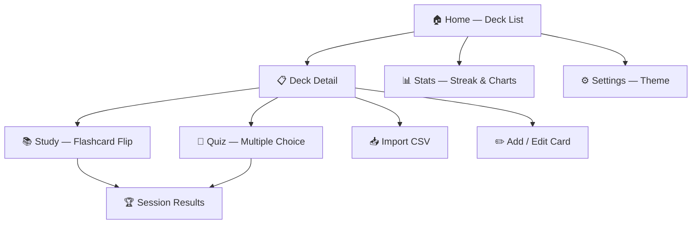
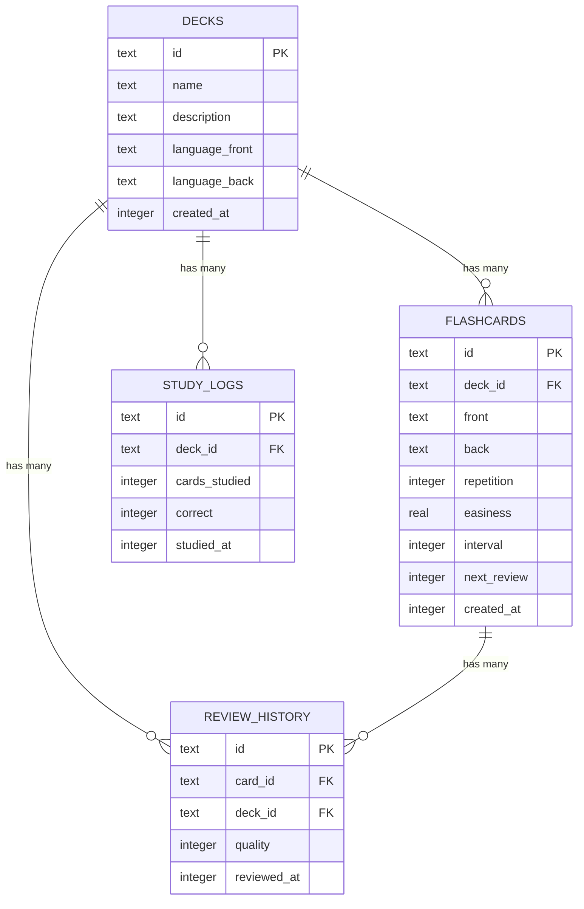

<p align="center">
  
</p>

<h1 align="center">ZenFlashCards</h1>

<p align="center">
  <em>Dark · Calm · Focused — Learn vocabulary the Zen way</em>
</p>

<p align="center">
  <a href="LICENSE"></a>
  <a href="#"></a>
  <a href="#"></a>
  <a href="#"></a>
  <a href="#"></a>
  <a href="#"></a>
</p>

---

## 📑 Table of Contents

- [Introduction](#-introduction)
- [Key Features](#-key-features)
- [Interface Preview](#-interface-preview)
- [System Architecture](#-system-architecture)
- [Database](#-database)
- [SM-2 Algorithm](#-sm-2-algorithm)
- [Design System](#-design-system)
- [Tech Stack](#-tech-stack)
- [Getting Started](#-getting-started)
- [Extensive Documentation 📚](#-extensive-documentation)

---

## 📖 Introduction

**ZenFlashCards** is an Android vocabulary learning application using the Flashcard method, integrated with the **Spaced Repetition SM-2** algorithm (similar to Anki/SuperMemo). Data is stored **100% offline** using SQLite — no login required, no internet needed.

### ✨ Key Features

| Feature | Description |
|-----------|-------|
| 🃏 **3D Flip Flashcard** | Flip cards with smooth Y-axis 3D rotation animation (400ms) |
| 🧠 **Spaced Repetition (SM-2)** | Spaced repetition algorithm automatically calculates optimal review times |
| 🎯 **Multiple Choice Quiz** | Test knowledge with 4 options and instant feedback |
| 📊 **Detailed Statistics** | Consecutive learning streak, 7-day bar chart, rating distribution pie chart |
| 📥 **Import CSV** | Bulk import vocabulary from CSV files (supports Android 13+ SAF) |
| 🌙 **Dark / Light Mode** | Minimalist dark Zen interface, supports light mode & system default |
| 🌍 **Multi-language** | Support creating card decks for any language pair |
| ♿ **WCAG AA** | Reaches Accessibility standards with dual visual cues (color + icon) |

---

## 📸 Interface Preview

> An Interactive Prototype is available at [`prototype/index.html`](prototype/index.html) — open with a browser for a fully interactive experience of all 7 screens.

| Home | Study | Quiz | Stats |
|:----:|:-----:|:----:|:-----:|
| Deck list with due today badge | 3D Flip Flashcard with 3 rating buttons | 4-option multiple choice with ✓/✗ feedback | Streak 🔥 & statistics charts |

---

## 🏗️ System Architecture

### Architecture Overview

```
┌──────────────────────────────────────────────┐
│              Presentation Layer              │
│  Screens · Widgets · Theme · Components      │
├──────────────────────────────────────────────┤
│            State Management Layer            │
│      ViewModels · Provider (ChangeNotifier)   │
├──────────────────────────────────────────────┤
│               Data Access Layer              │
│      DAOs · Database Helper · CSV Parser     │
├──────────────────────────────────────────────┤
│              Storage & Engine                │
│         SQLite (sqflite) · SM-2 Algorithm    │
└──────────────────────────────────────────────┘
```

### Directory Structure

```
lib/
├── main.dart                          # Entry point
├── app.dart                           # MaterialApp, ThemeData, routing
├── core/
│   ├── database/
│   │   ├── database_helper.dart       # SQLite init, migrations, indexes
│   │   └── dao/
│   │       ├── deck_dao.dart          # CRUD Deck
│   │       ├── card_dao.dart          # CRUD Card, cards_due_today query
│   │       ├── study_log_dao.dart     # Session aggregate logs
│   │       └── review_history_dao.dart # Per-flip quality logs
│   ├── models/
│   │   ├── deck.dart                  # Deck data model
│   │   ├── flashcard.dart             # Flashcard + SM-2 fields
│   │   ├── study_log.dart             # Session summary model
│   │   └── review_history.dart        # Individual review model
│   ├── algorithms/
│   │   └── sm2.dart                   # SM-2 Spaced Repetition engine
│   └── utils/
│       ├── csv_parser.dart            # CSV import with SAF fallback
│       └── constants.dart             # App-wide constants
├── features/
│   ├── home/                          # Home screen (deck list)
│   ├── deck/                          # Deck CRUD screens
│   ├── card/                          # Card form + duplicate warning
│   ├── study/                         # Flashcard flip + Quiz
│   ├── stats/                         # Charts & streak tracking
│   └── settings/                      # Theme toggle & app info
└── shared/
    ├── widgets/                       # FlipCard3D, ProgressBar, EmptyState
    └── theme/                         # AppTheme, AppColors tokens
```

### Data Flow



---

## 🗄️ Database

SQLite with **4 tables** and **6 optimized indexes**:



> **Data writing rule**: `review_history` writes **on every card flip** (granular). `study_logs` writes only **1 row at the end of the session** (aggregate). This design allows a pie chart breakdown of Hard/OK/Easy without bloating the aggregate table.

---

## 🧠 SM-2 Algorithm

Implementation of the standard **SuperMemo 2** algorithm:

```
Input:  repetition, easiness (EF), interval, quality (0-5)
Output: new_repetition, new_easiness, new_interval, next_review_date

Rules:
├── quality < 3 (Hard)  → reset repetition = 0, interval = 1 day
├── quality ≥ 3 (OK/Easy) → repetition++
│   ├── rep = 1 → interval = 1 day
│   ├── rep = 2 → interval = 6 days
│   └── rep > 2 → interval = interval × EF
└── EF = EF + (0.1 - (5-q) × (0.08 + (5-q) × 0.02))
    └── EF minimum = 1.3
```

**UI quality mapping:**

| Button | Emoji | SM-2 Quality | Meaning |
|-----|-------|:------------:|---------|
| Hard | 😅 | 0 | Reset, review again tomorrow |
| OK | 😊 | 3 | Remembered, space slightly |
| Easy | 😎 | 5 | Mastered, space further |

---

## 🎨 Design System

### Color Palette

| Token | Dark Mode | Light Mode | Role |
|-------|:---------:|:----------:|---------|
| `bg_main` | `#0F172A` | `#F8FAFC` | Main background |
| `bg_surface` | `#1E293B` | `#FFFFFF` | Card, bottom bar |
| `primary` | `#4F46E5` | `#4F46E5` | Accent Indigo |
| `text_primary` | `#F8FAFC` | `#0F172A` | Primary text |
| `text_secondary` | `#94A3B8` | — | Secondary text |
| `text_caption` | `#A0AEC0` | — | Caption (WCAG AA ≥ 4.5:1) |
| `rate_hard` | `#EF4444` | — | Rating: Hard |
| `rate_ok` | `#F59E0B` | — | Rating: OK |
| `rate_easy` | `#22C55E` | — | Rating: Easy |

### Typography — Inter

| Style | Size | Weight | Used for |
|-------|:----:|:------:|----------|
| Display | 32sp | Bold 700 | Flashcard vocabulary |
| Headline | 20sp | SemiBold 600 | Deck name, title |
| Title | 16sp | SemiBold 600 | Card list name |
| Body | 14sp | Regular 400 | Description, subtitle |
| Label | 12sp | Medium 500 | Tag, badge |
| Caption | 11sp | Regular 400 | Small metadata |

### Shape System

| Element | Border Radius |
|---------|:------------:|
| Flashcard | 24dp |
| DeckCard | 16dp |
| Button / Quiz Option | 12dp |
| List Item | 8dp |

---

## 🛠️ Tech Stack

| Layer | Technology | Version |
|-------|----------|:---------:|
| Framework | Flutter | 3.x |
| Language | Dart | 3.x |
| Database | SQLite via `sqflite` | ^2.3.3+1 |
| State Management | Provider (ChangeNotifier) | ^6.1.2 |
| Charts | fl_chart | ^0.69.0 |
| File Import | file_picker (SAF) | ^8.1.2 |
| CSV Parsing | csv | ^6.0.0 |
| Typography | google_fonts (Inter) | ^6.2.1 |
| Preferences | shared_preferences | ^2.3.2 |
| UUID | uuid | ^4.4.2 |
| Date Formatting | intl | ^0.19.0 |

---

## 🚀 Getting Started

### Requirements

- Flutter SDK 3.x or higher
- Dart SDK 3.x or higher
- Android SDK (API 21+ / Android 5.0+)
- Android Studio or VS Code with Flutter extension

### Installation

```bash
# Clone repository
git clone https://github.com/githubuser2777/ZenFlashCard.git
cd ZenFlashCard

# Install dependencies
flutter pub get

# Check environment
flutter doctor

# Run on emulator or device
flutter run
```

### Build APK

```bash
# Debug build
flutter build apk --debug

# Release build
flutter build apk --release

# Static analysis
flutter analyze
```

---

## 🧪 Testing

```bash
# Run the entire test suite
flutter test

# Run only SM-2 unit tests
flutter test test/core/algorithms/sm2_test.dart
```

### SM-2 Test Cases

| # | Test Case | Expected Result |
|:-:|-----------|-------------------|
| 1 | `quality < 3` | Reset `repetition = 0`, `interval = 1` |
| 2 | 1st correct review | `interval = 1` day |
| 3 | 2nd correct review | `interval = 6` days |
| 4 | `quality = 5` (Easy) | `easiness` increases > 2.5 |
| 5 | Sharp EF decrease | `easiness` never < 1.3 |
| 6 | `next_review` | Always a future date |

---

## 📁 Extensive Documentation 📚

We have a dedicated **Documentation Hub** to cover every architectural and design decision in the app.

👉 **[Go to the Documentation Hub (docs/index.md)](docs/index.md)** 👈

Or jump directly into specific documents:

| Document | Description |
|-----------|-------|
| [`docs/index.md`](docs/index.md) | **Documentation Hub** — The central entry point |
| [`docs/diagrams.md`](docs/diagrams.md) | **System Diagrams** — Detailed C4, State, and Sequence diagrams |
| [`docs/architecture.md`](docs/architecture.md) | System architecture technical documentation |
| [`docs/database.md`](docs/database.md) | Database schema, indexes & query patterns |
| [`docs/design-system.md`](docs/design-system.md) | Design tokens, color, typography, components |
| [`docs/api-reference.md`](docs/api-reference.md) | API Reference for DAOs, ViewModels & SM-2 |
| [`Plan_arch/Phase_plan.md`](Plan_arch/Phase_plan.md) | Architecture & code implementation roadmap |
| [`Plan_UI/Phase_plan.md`](Plan_UI/Phase_plan.md) | UI/UX implementation roadmap |
| [`prototype/index.html`](prototype/index.html) | Interactive UI Prototype (open with browser) |
| [`CONTRIBUTING.md`](CONTRIBUTING.md) | Guidelines for contributing to the project |

---

## ♿ Accessibility (WCAG AA)

ZenFlashCards is committed to meeting the **WCAG AA** standard with the following measures:

- **Contrast Ratio**: Caption text `#A0AEC0` on surface `#1E293B` achieves **5.2:1** (exceeds AA threshold of 4.5:1)
- **Dual Cues**: Quiz uses both **colors** (green/red) and **icons** (✓/✗) for colorblind users
- **Supplementary Emojis**: Rating buttons include emojis (😅😊😎) so they don't rely solely on color
- **Touch Target**: All interactive areas are at least **48dp × 48dp**

---

## 📜 License

The project is distributed under the [MIT License](LICENSE).

```
MIT License — Copyright (c) 2026 Lux
```

---

## 🙏 Credits

- **SM-2 Algorithm**: Based on [SuperMemo 2](https://www.supermemo.com/en/archives1990-2015/english/ol/sm2) by Piotr Woźniak
- **Design Inspiration**: Zen philosophy — minimalist, focused, distraction-free
- **Font**: [Inter](https://fonts.google.com/specimen/Inter) by Rasmus Andersson
- **Icons**: Material Design 3 system icons

---

<p align="center">
  Made with 🧘 by <a href="https://github.com/githubuser2777">Lux</a>
</p>
