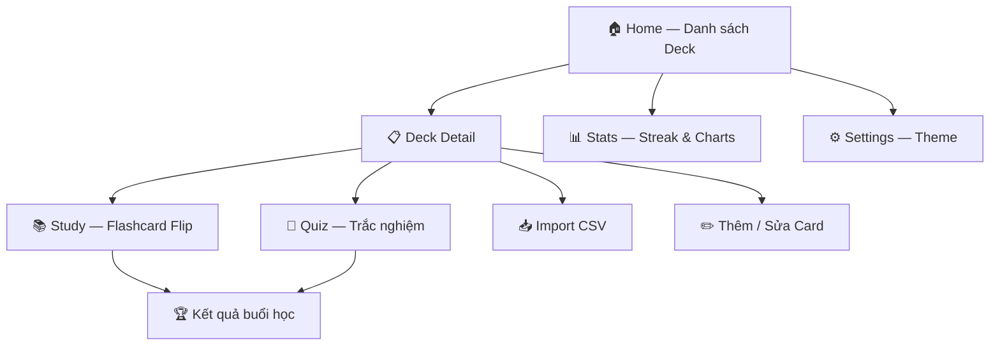
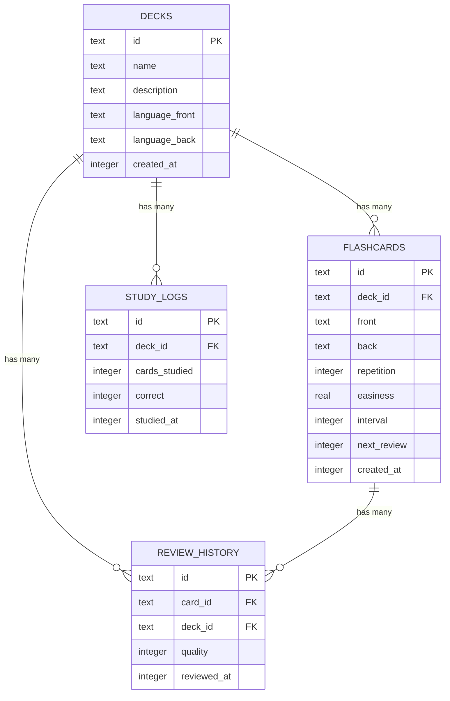

<p align="center">
  
</p>

<h1 align="center">ZenFlashCards</h1>

<p align="center">
  <em>Dark · Calm · Focused — Học từ vựng theo phong cách Zen</em>
</p>

<p align="center">
  <a href="LICENSE"></a>
  <a href="#"></a>
  <a href="#"></a>
  <a href="#"></a>
  <a href="#"></a>
  <a href="#"></a>
</p>

---

## 📖 Giới Thiệu

**ZenFlashCards** là ứng dụng Android học từ vựng theo phương pháp Flashcard, tích hợp thuật toán **Spaced Repetition SM-2** (tương tự Anki/SuperMemo). Dữ liệu được lưu trữ **100% offline** bằng SQLite — không cần đăng nhập, không cần internet.

### ✨ Tính Năng Chính

| Tính năng | Mô tả |
|-----------|-------|
| 🃏 **Flashcard 3D Flip** | Lật thẻ với animation 3D xoay trục Y mượt mà (400ms) |
| 🧠 **Spaced Repetition (SM-2)** | Thuật toán lặp lại ngắt quãng tự động tính thời điểm ôn tối ưu |
| 🎯 **Quiz Trắc Nghiệm** | Kiểm tra kiến thức với 4 lựa chọn, phản hồi tức thì |
| 📊 **Thống Kê Chi Tiết** | Streak học liên tục, biểu đồ cột 7 ngày, biểu đồ tròn phân bổ đánh giá |
| 📥 **Import CSV** | Nhập hàng loạt từ vựng từ file CSV (hỗ trợ Android 13+ SAF) |
| 🌙 **Dark / Light Mode** | Giao diện Zen tối tối giản, hỗ trợ chế độ sáng & theo hệ thống |
| 🌍 **Đa Ngôn Ngữ** | Hỗ trợ tạo bộ thẻ cho bất kỳ cặp ngôn ngữ nào |
| ♿ **WCAG AA** | Đạt chuẩn Accessibility với tín hiệu thị giác kép (màu + icon) |

---

## 📸 Xem Trước Giao Diện

> Bản Interactive Prototype có tại [`prototype/index.html`](prototype/index.html) — mở bằng trình duyệt để trải nghiệm tương tác đầy đủ cả 7 màn hình.

| Home | Study | Quiz | Stats |
|:----:|:-----:|:----:|:-----:|
| Danh sách Deck với badge due today | Flashcard 3D Flip với 3 nút đánh giá | Trắc nghiệm 4 đáp án với phản hồi ✓/✗ | Streak 🔥 & biểu đồ thống kê |

---

## 🏗️ Kiến Trúc Hệ Thống

### Tổng Quan Kiến Trúc

```
┌──────────────────────────────────────────────┐
│              Presentation Layer              │
│  Screens · Widgets · Theme · Components      │
├──────────────────────────────────────────────┤
│            State Management Layer            │
│      ViewModels · Provider (ChangeNotifier)   │
├──────────────────────────────────────────────┤
│               Data Access Layer              │
│      DAOs · Database Helper · CSV Parser     │
├──────────────────────────────────────────────┤
│              Storage & Engine                │
│         SQLite (sqflite) · SM-2 Algorithm    │
└──────────────────────────────────────────────┘
```

### Cấu Trúc Thư Mục

```
lib/
├── main.dart                          # Entry point
├── app.dart                           # MaterialApp, ThemeData, routing
├── core/
│   ├── database/
│   │   ├── database_helper.dart       # SQLite init, migrations, indexes
│   │   └── dao/
│   │       ├── deck_dao.dart          # CRUD Deck
│   │       ├── card_dao.dart          # CRUD Card, cards_due_today query
│   │       ├── study_log_dao.dart     # Session aggregate logs
│   │       └── review_history_dao.dart # Per-flip quality logs
│   ├── models/
│   │   ├── deck.dart                  # Deck data model
│   │   ├── flashcard.dart             # Flashcard + SM-2 fields
│   │   ├── study_log.dart             # Session summary model
│   │   └── review_history.dart        # Individual review model
│   ├── algorithms/
│   │   └── sm2.dart                   # SM-2 Spaced Repetition engine
│   └── utils/
│       ├── csv_parser.dart            # CSV import with SAF fallback
│       └── constants.dart             # App-wide constants
├── features/
│   ├── home/                          # Home screen (deck list)
│   ├── deck/                          # Deck CRUD screens
│   ├── card/                          # Card form + duplicate warning
│   ├── study/                         # Flashcard flip + Quiz
│   ├── stats/                         # Charts & streak tracking
│   └── settings/                      # Theme toggle & app info
└── shared/
    ├── widgets/                       # FlipCard3D, ProgressBar, EmptyState
    └── theme/                         # AppTheme, AppColors tokens
```

### Luồng Dữ Liệu



---

## 🗄️ Cơ Sở Dữ Liệu

SQLite với **4 bảng** và **6 indexes** tối ưu:



> **Quy tắc ghi dữ liệu**: `review_history` ghi **mỗi lần lật card** (granular). `study_logs` chỉ ghi **1 row khi kết thúc buổi** (aggregate). Thiết kế này cho phép pie chart breakdown Khó/OK/Dễ mà không làm phồng bảng aggregate.

---

## 🧠 Thuật Toán SM-2

Triển khai thuật toán **SuperMemo 2** chuẩn:

```
Input:  repetition, easiness (EF), interval, quality (0-5)
Output: new_repetition, new_easiness, new_interval, next_review_date

Quy tắc:
├── quality < 3 (Khó)  → reset repetition = 0, interval = 1 ngày
├── quality ≥ 3 (OK/Dễ) → repetition++
│   ├── rep = 1 → interval = 1 ngày
│   ├── rep = 2 → interval = 6 ngày
│   └── rep > 2 → interval = interval × EF
└── EF = EF + (0.1 - (5-q) × (0.08 + (5-q) × 0.02))
    └── EF minimum = 1.3
```

**Mapping quality từ UI:**

| Nút | Emoji | Quality SM-2 | Ý nghĩa |
|-----|-------|:------------:|---------|
| Khó | 😅 | 0 | Reset, ôn lại ngày mai |
| OK | 😊 | 3 | Nhớ được, giãn nhẹ |
| Dễ | 😎 | 5 | Thuộc rồi, giãn xa |

---

## 🎨 Design System

### Bảng Màu

| Token | Dark Mode | Light Mode | Vai trò |
|-------|:---------:|:----------:|---------|
| `bg_main` | `#0F172A` | `#F8FAFC` | Nền chính |
| `bg_surface` | `#1E293B` | `#FFFFFF` | Card, bottom bar |
| `primary` | `#4F46E5` | `#4F46E5` | Accent Indigo |
| `text_primary` | `#F8FAFC` | `#0F172A` | Chữ chính |
| `text_secondary` | `#94A3B8` | — | Chữ phụ |
| `text_caption` | `#A0AEC0` | — | Caption (WCAG AA ≥ 4.5:1) |
| `rate_hard` | `#EF4444` | — | Đánh giá: Khó |
| `rate_ok` | `#F59E0B` | — | Đánh giá: OK |
| `rate_easy` | `#22C55E` | — | Đánh giá: Dễ |

### Typography — Inter

| Style | Size | Weight | Dùng cho |
|-------|:----:|:------:|----------|
| Display | 32sp | Bold 700 | Từ vựng flashcard |
| Headline | 20sp | SemiBold 600 | Tên deck, title |
| Title | 16sp | SemiBold 600 | Tên card list |
| Body | 14sp | Regular 400 | Mô tả, subtitle |
| Label | 12sp | Medium 500 | Tag, badge |
| Caption | 11sp | Regular 400 | Metadata nhỏ |

### Shape System

| Element | Border Radius |
|---------|:------------:|
| Flashcard | 24dp |
| DeckCard | 16dp |
| Button / Quiz Option | 12dp |
| List Item | 8dp |

---

## 🛠️ Tech Stack

| Layer | Công nghệ | Phiên bản |
|-------|----------|:---------:|
| Framework | Flutter | 3.x |
| Language | Dart | 3.x |
| Database | SQLite via `sqflite` | ^2.3.3+1 |
| State Management | Provider (ChangeNotifier) | ^6.1.2 |
| Charts | fl_chart | ^0.69.0 |
| File Import | file_picker (SAF) | ^8.1.2 |
| CSV Parsing | csv | ^6.0.0 |
| Typography | google_fonts (Inter) | ^6.2.1 |
| Preferences | shared_preferences | ^2.3.2 |
| UUID | uuid | ^4.4.2 |
| Date Formatting | intl | ^0.19.0 |

---

## 🚀 Bắt Đầu

### Yêu Cầu

- Flutter SDK 3.x trở lên
- Dart SDK 3.x trở lên
- Android SDK (API 21+ / Android 5.0+)
- Android Studio hoặc VS Code với Flutter extension

### Cài Đặt

```bash
# Clone repository
git clone https://github.com/githubuser2777/ZenFlashCard.git
cd ZenFlashCard

# Cài đặt dependencies
flutter pub get

# Kiểm tra môi trường
flutter doctor

# Chạy trên emulator hoặc thiết bị
flutter run
```

### Build APK

```bash
# Debug build
flutter build apk --debug

# Release build
flutter build apk --release

# Kiểm tra tĩnh
flutter analyze
```

---

## 🧪 Testing

```bash
# Chạy toàn bộ test suite
flutter test

# Chạy riêng SM-2 unit tests
flutter test test/core/algorithms/sm2_test.dart
```

### Các Test Case SM-2

| # | Test Case | Kết quả mong đợi |
|:-:|-----------|-------------------|
| 1 | `quality < 3` | Reset `repetition = 0`, `interval = 1` |
| 2 | Lần ôn đúng thứ 1 | `interval = 1` ngày |
| 3 | Lần ôn đúng thứ 2 | `interval = 6` ngày |
| 4 | `quality = 5` (Dễ) | `easiness` tăng > 2.5 |
| 5 | EF giảm mạnh | `easiness` không bao giờ < 1.3 |
| 6 | `next_review` | Luôn ở thời điểm tương lai |

---

## 📁 Tài Liệu Dự Án

| Tài liệu | Mô tả |
|-----------|-------|
| [`Plan_UI/plan_UI-UX.md`](Plan_UI/plan_UI-UX.md) | Design Brief — thiết kế UI/UX chi tiết 7 màn hình |
| [`Plan_UI/Phase_plan.md`](Plan_UI/Phase_plan.md) | Lộ trình triển khai UI/UX theo 5 giai đoạn |
| [`Plan_arch/plan_architect.md`](Plan_arch/plan_architect.md) | Kiến trúc tổng quan — schema, DAOs, SM-2, features |
| [`Plan_arch/Phase_plan.md`](Plan_arch/Phase_plan.md) | Lộ trình triển khai kiến trúc & code theo 5 giai đoạn |
| [`docs/architecture.md`](docs/architecture.md) | Tài liệu kỹ thuật kiến trúc hệ thống |
| [`docs/database.md`](docs/database.md) | Schema database, indexes & query patterns |
| [`docs/design-system.md`](docs/design-system.md) | Design tokens, color, typography, components |
| [`docs/api-reference.md`](docs/api-reference.md) | API Reference cho DAOs, ViewModels & SM-2 |
| [`prototype/index.html`](prototype/index.html) | Interactive UI Prototype (mở bằng browser) |
| [`CONTRIBUTING.md`](CONTRIBUTING.md) | Hướng dẫn đóng góp cho dự án |

---

## ♿ Accessibility (WCAG AA)

ZenFlashCards cam kết đạt chuẩn **WCAG AA** với các biện pháp:

- **Contrast Ratio**: Text caption `#A0AEC0` trên surface `#1E293B` đạt **5.2:1** (vượt ngưỡng AA 4.5:1)
- **Tín hiệu kép**: Quiz dùng cả **màu sắc** (xanh/đỏ) lẫn **icon** (✓/✗) cho người mù màu
- **Emoji bổ trợ**: Nút đánh giá kèm emoji (😅😊😎) không chỉ dựa vào màu
- **Touch Target**: Tất cả vùng tương tác tối thiểu **48dp × 48dp**

---

## 📜 License

Dự án được phân phối theo giấy phép [MIT License](LICENSE).

```
MIT License — Copyright (c) 2026 Lux
```

---

## 🙏 Credits

- **SM-2 Algorithm**: Dựa trên [SuperMemo 2](https://www.supermemo.com/en/archives1990-2015/english/ol/sm2) bởi Piotr Woźniak
- **Design Inspiration**: Zen philosophy — tối giản, tập trung, không xao nhãng
- **Font**: [Inter](https://fonts.google.com/specimen/Inter) bởi Rasmus Andersson
- **Icons**: Material Design 3 system icons

---

<p align="center">
  Made with 🧘 by <a href="https://github.com/githubuser2777">Lux</a>
</p>
