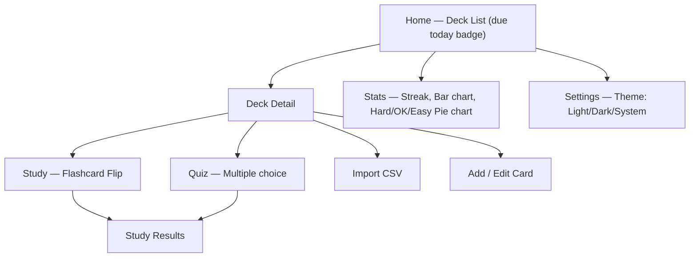

# 📱 ZenFlashCards — Flutter App

## Project Description

Build an Android app **ZenFlashCards** — vocabulary learning using the Flashcard method, built with Flutter (Dart), saving data 100% offline using SQLite (via `sqflite`). The app supports multiple languages, the Spaced Repetition (SM-2) algorithm, quizzes, CSV import, statistics, and dark mode.

---

## User Review Required

> [!IMPORTANT]
> **App name**: **"ZenFlashCards"** ✅ (confirmed)

> [!IMPORTANT]
> **Package name**: `com.example.zenflashcards` — you should change this to your real name/identifier before publishing to the Play Store.

> [!IMPORTANT]
> **`review_history` table**: Added to the schema to log each individual card review along with its quality. This allows: a pie chart breakdown by Hard/OK/Easy, and later easily implementing an Anki-style heatmap. Trade-off: writes 1 extra row per card flip — completely acceptable for offline SQLite.

---

## Open Questions

> [!IMPORTANT]
> You deselected **Text-to-Speech** — I will skip it, but I will leave a `// TODO: TTS hook` comment where it can be integrated later.

---

## Overall Architecture

```text
lib/
├── main.dart
├── app.dart                    # MaterialApp, ThemeData, routing
├── core/
│   ├── di/
│   │   └── service_locator.dart  # Dependency injection setup (get_it)
│   ├── database/
│   │   ├── database_helper.dart   # SQLite setup, migrations, indexes
│   │   └── dao/
│   │       ├── deck_dao.dart
│   │       ├── card_dao.dart          # Includes cards_due_today query
│   │       ├── study_log_dao.dart
│   │       └── review_history_dao.dart
│   ├── repositories/
│   │   └── deck_repository.dart  # Abstract repository pattern
│   ├── routing/
│   │   └── app_router.dart       # go_router configuration
│   ├── models/
│   │   ├── deck.dart
│   │   ├── flashcard.dart
│   │   ├── study_log.dart
│   │   └── review_history.dart
│   ├── algorithms/
│   │   └── sm2.dart              # Spaced Repetition SM-2 algorithm
│   └── utils/
│       ├── csv_parser.dart
│       ├── constants.dart
│       └── failure.dart          # Error handling (fpdart Either<Failure, T>)
├── features/
│   ├── home/
│   │   ├── home_screen.dart
│   │   └── home_viewmodel.dart
│   ├── deck/
│   │   ├── deck_list_screen.dart
│   │   ├── deck_detail_screen.dart
│   │   ├── deck_form_screen.dart
│   │   └── deck_viewmodel.dart
│   ├── card/
│   │   ├── card_list_screen.dart
│   │   ├── card_form_screen.dart
│   │   └── card_viewmodel.dart
│   ├── study/
│   │   ├── flashcard_study_screen.dart
│   │   ├── quiz_screen.dart
│   │   └── study_viewmodel.dart
│   ├── stats/
│   │   ├── stats_screen.dart
│   │   └── stats_viewmodel.dart
│   └── settings/
│       └── settings_screen.dart
└── shared/
    ├── widgets/
    │   ├── flip_card.dart
    │   ├── progress_bar.dart
    │   └── empty_state.dart
    └── theme/
        ├── app_theme.dart
        └── app_colors.dart
```

---

## Proposed Changes

### 1. Initialize Flutter Project

#### [NEW] Project scaffold

```bash
flutter create --org com.example --project-name zenflashcards zenflashcards
```

Root folder: `zenflashcards/`.

---

### 2. Dependencies (`pubspec.yaml`)

#### [MODIFY] pubspec.yaml

```yaml
dependencies:
  flutter:
    sdk: flutter

  # Database
  sqflite: ^2.3.3+1
  path: ^1.9.0

  # State management
  provider: ^6.1.2

  # File import (uses SAF on Android 13+ — no storage permission needed)
  file_picker: ^8.1.2

  # CSV parsing
  csv: ^6.0.0

  # Charts
  fl_chart: ^0.69.0

  # Shared preferences (theme mode)
  shared_preferences: ^2.3.2

  # UUID for IDs
  uuid: ^4.4.2

  # Intl (date formatting)
  intl: ^0.19.0

  # Inter Font via Google Fonts — no need to bundle .ttf manually
  google_fonts: ^6.2.1

dev_dependencies:
  flutter_test:
    sdk: flutter
  flutter_lints: ^4.0.0
```

---

### 3. Database Layer

#### [NEW] `database_helper.dart`

Initialize SQLite, **4 tables**, **indexes** for frequent queries:

```sql
-- Deck: card decks (removed card_count — calculate COUNT(*) when needed, avoids data drift)
CREATE TABLE decks (
  id TEXT PRIMARY KEY,
  name TEXT NOT NULL,
  description TEXT,
  language_front TEXT NOT NULL,
  language_back TEXT NOT NULL,
  created_at INTEGER NOT NULL
);

-- Flashcard
CREATE TABLE flashcards (
  id TEXT PRIMARY KEY,
  deck_id TEXT NOT NULL,
  front TEXT NOT NULL,
  back TEXT NOT NULL,
  -- SM-2 fields
  repetition INTEGER DEFAULT 0,
  easiness REAL DEFAULT 2.5,
  interval INTEGER DEFAULT 1,
  next_review INTEGER NOT NULL,   -- unix ms; initialized to now() → appears immediately first time
  created_at INTEGER NOT NULL,
  FOREIGN KEY (deck_id) REFERENCES decks(id) ON DELETE CASCADE
);

-- Indexes for querying cards by deck and "due today" queries
CREATE INDEX idx_flashcards_deck ON flashcards(deck_id);
CREATE INDEX idx_flashcards_next_review ON flashcards(next_review);

-- Study log: aggregated by study session
CREATE TABLE study_logs (
  id TEXT PRIMARY KEY,
  deck_id TEXT NOT NULL,
  cards_studied INTEGER NOT NULL,
  correct INTEGER NOT NULL,
  studied_at INTEGER NOT NULL     -- unix ms, date portion used for bar chart / streak
);

-- Indexes for streaks and 7-day bar chart (both filter by studied_at)
CREATE INDEX idx_study_logs_date ON study_logs(studied_at);

-- Review history: logs every individual card review along with quality
-- Used for: Hard/OK/Easy pie chart, future Anki-style heatmaps
CREATE TABLE review_history (
  id TEXT PRIMARY KEY,
  card_id TEXT NOT NULL,
  deck_id TEXT NOT NULL,
  quality INTEGER NOT NULL,       -- 0=Hard, 3=OK, 5=Easy (SM-2 scale)
  reviewed_at INTEGER NOT NULL,
  FOREIGN KEY (card_id) REFERENCES flashcards(id) ON DELETE CASCADE
);

CREATE INDEX idx_review_history_card ON review_history(card_id);
CREATE INDEX idx_review_history_deck ON review_history(deck_id);
-- NOTE: index on reviewed_at is deferred to v2 — v1 pie chart only uses SELECT by deck_id,
-- no date-range filtering needed yet. Add when building heatmaps / date-range stats.
```

#### [NEW] `card_dao.dart` — Query cards due today

```dart
/// Get all cards in a deck due today (next_review <= now)
Future<List<Flashcard>> getCardsDueToday(String deckId) async {
  final db = await _db;
  final now = DateTime.now().millisecondsSinceEpoch;
  final rows = await db.query(
    'flashcards',
    where: 'deck_id = ? AND next_review <= ?',
    whereArgs: [deckId, now],
    orderBy: 'next_review ASC',
  );
  return rows.map(Flashcard.fromMap).toList();
}

/// Total cards due today across ALL decks — used for Home badge
Future<int> getTotalCardsDueToday() async {
  final db = await _db;
  final now = DateTime.now().millisecondsSinceEpoch;
  final result = await db.rawQuery(
    'SELECT COUNT(*) as count FROM flashcards WHERE next_review <= ?',
    [now],
  );
  return Sqflite.firstIntValue(result) ?? 0;
}

/// Count cards in deck (replaces denormalized card_count)
Future<int> getCardCount(String deckId) async {
  final db = await _db;
  final result = await db.rawQuery(
    'SELECT COUNT(*) as count FROM flashcards WHERE deck_id = ?',
    [deckId],
  );
  return Sqflite.firstIntValue(result) ?? 0;
}
```

**Initialize `next_review` for new cards:**

```dart
// In card_dao.dart — insertCard()
final now = DateTime.now().millisecondsSinceEpoch;
final card = Flashcard(
  id: const Uuid().v4(),
  deckId: deckId,
  front: front,
  back: back,
  nextReview: now,  // ← next_review = now → appears immediately in first review
  createdAt: now,
);
```

#### [NEW] `sm2.dart` — SM-2 Algorithm

```dart
/// SM-2 Spaced Repetition Algorithm
/// quality: 0=Blackout/Hard, 3=OK, 5=Perfect/Easy
class SM2Result {
  final int repetition;
  final double easiness;
  final int intervalDays;
  final int nextReviewMs; // unix milliseconds
}

SM2Result calculateNextReview({
  required int repetition,
  required double easiness,
  required int intervalDays,
  required int quality, // 0–5
}) {
  // If quality < 3: reset to beginning
  int newRep = quality < 3 ? 0 : repetition + 1;

  // Calculate new interval
  int newInterval;
  if (newRep <= 1) {
    newInterval = 1;
  } else if (newRep == 2) {
    newInterval = 6;
  } else {
    newInterval = (intervalDays * easiness).round();
  }

  // Update easiness factor
  double newEasiness = easiness + (0.1 - (5 - quality) * (0.08 + (5 - quality) * 0.02));
  if (newEasiness < 1.3) newEasiness = 1.3; // minimum EF

  final nextMs = DateTime.now()
      .add(Duration(days: newInterval))
      .millisecondsSinceEpoch;

  return SM2Result(
    repetition: newRep,
    easiness: newEasiness,
    intervalDays: newInterval,
    nextReviewMs: nextMs,
  );
}
```

---

### 4. Features

#### [NEW] Home Screen

- Grid/List of created Decks
- FAB to create new Deck
- **Badge** for total cards due today (queries `getTotalCardsDueToday()`)
- Number of cards in deck shown via `getCardCount()` — no longer uses `card_count` column

#### [NEW] Deck Detail Screen

- List of cards in the deck
- "Study Now" button → Study Screen (loads only cards due today)
- "Quiz" button → Quiz Screen
- "Import CSV" button → file picker (SAF, no permission declaration needed)
- "Add Card" button → Card Form

#### [NEW] Card Form — Soft warning for duplicates

Does not block the user (they might intentionally add 2 identical cards), but shows a gentle warning:

```dart
// card_viewmodel.dart — checkDuplicate() called before save
Future<bool> isDuplicate(String deckId, String front, String back) async {
  final existing = await cardDao.findByFrontBack(deckId, front.trim(), back.trim());
  return existing != null;
}

// card_form_screen.dart — in onSave handler
if (await viewModel.isDuplicate(deckId, front, back)) {
  final confirmed = await showDialog<bool>(
    context: context,
    builder: (_) => AlertDialog(
      title: const Text('Potential Duplicate'),
      content: const Text('A card with similar content already exists in this deck. Add anyway?'),
      actions: [
        TextButton(onPressed: () => Navigator.pop(context, false), child: const Text('Cancel')),
        TextButton(onPressed: () => Navigator.pop(context, true),  child: const Text('Add anyway')),
      ],
    ),
  );
  if (confirmed != true) return; // user cancelled
}
await viewModel.saveCard(deckId, front, back);
```

#### [NEW] CSV Import — Handle file picker + duplicates

**Scoped storage issue**: On some Android versions, `file_picker` returns `PlatformFile.path == null` (SAF only grants bytes, not a direct path). Must fallback to `PlatformFile.bytes`:

```dart
// csv_parser.dart — read file safely
Future<String> _readCsvContent(PlatformFile file) async {
  if (file.path != null) {
    // Happy path: has direct path (Android <13 or emulator)
    return await File(file.path!).readAsString();
  } else if (file.bytes != null) {
    // Fallback: SAF only provides bytes (Android 13+ scoped storage)
    return utf8.decode(file.bytes!);
  } else {
    throw Exception('Failed to read file — both path and bytes are null');
  }
}

// file_picker call — always request withData: true for bytes fallback
final result = await FilePicker.platform.pickFiles(
  type: FileType.custom,
  allowedExtensions: ['csv', 'txt'],
  withData: true,   // ← mandatory for PlatformFile.bytes
);
```

**Duplicate Handling:**

```dart
Future<ImportResult> importCsv(String deckId, PlatformFile file) async {
  final content = await _readCsvContent(file);
  final parsedRows = _parse(content); // auto-detect separator: , ; \t

  final existing = await cardDao.getAllCards(deckId);
  final existingPairs = existing.map((c) => '${c.front}|||${c.back}').toSet();

  int imported = 0, skipped = 0;
  for (final row in parsedRows) {
    final key = '${row.front}|||${row.back}';
    if (existingPairs.contains(key)) {
      skipped++; // skip exact front + back matches
      continue;
    }
    await cardDao.insertCard(deckId, row.front, row.back);
    imported++;
  }
  return ImportResult(imported: imported, skipped: skipped);
}
```

Shows snackbar after import: *"Imported 12 cards, skipped 3 duplicates"*.

#### [NEW] Study Screen (Flashcard Flip)

```text
┌────────────────────────┐
│                        │
│      [FRONT]           │  ← Tap to flip
│      "Apple"           │
│                        │
└────────────────────────┘
         ↓ flip
┌────────────────────────┐
│      [BACK]            │
│      "Quả táo"         │
│                        │
│  [😅 Hard] [😊 OK] [😎 Easy] │
└────────────────────────┘
```

- 3D flip animation (`AnimationController` + `Transform`)
- 3 buttons → SM-2 quality: Hard=0, OK=3, Easy=5
- Each tap: updates `flashcards` (SM-2 fields) + inserts into `review_history`
- Progress bar displaying session progress

**`study_viewmodel.dart` — End Session Logic:**

```dart
// Definition: quality >= 3 (OK or Easy) = correct; quality 0 (Hard) = incorrect
bool _isCorrect(int quality) => quality >= 3;

// Called when user presses Hard/OK/Easy for 1 card
Future<void> submitReview(Flashcard card, int quality) async {
  // 1. Calculate new SM-2
  final result = calculateNextReview(
    repetition: card.repetition,
    easiness: card.easiness,
    intervalDays: card.interval,
    quality: quality,
  );
  // 2. Update flashcard
  await cardDao.updateSM2(card.id, result);
  // 3. Log to review_history
  await reviewHistoryDao.insert(cardId: card.id, deckId: deckId, quality: quality);
  // 4. Track session stats
  _sessionStudied++;
  if (_isCorrect(quality)) _sessionCorrect++;
  // 5. If out of cards → end session
  if (_queueIsEmpty) await _finalizeSession();
}

// Insert 1 study_logs row after all due cards in session are finished
Future<void> _finalizeSession() async {
  await studyLogDao.insert(StudyLog(
    id: const Uuid().v4(),
    deckId: deckId,
    cardsStudied: _sessionStudied,
    correct: _sessionCorrect,    // quality >= 3
    studiedAt: DateTime.now().millisecondsSinceEpoch,
  ));
  // Navigate to result screen
  _state = StudyState.completed;
  notifyListeners();
}
```

> **Note**: `study_logs` only inserts **1 row per session** (when queue is exhausted), not per card flip. `review_history` is where individual flips are logged.

#### [NEW] Stats Screen

- **Streak** — consecutive days studied (from `study_logs`)
- **Bar chart** — cards studied over the last 7 days
- **Pie chart** — Hard/OK/Easy breakdown from `review_history` (quality 0 / 3 / 5)
- Total cards, total decks

#### [NEW] Settings Screen

- **Theme mode** — 3 options: ☀️ Light / 🌙 Dark / 🤖 System (`ThemeMode.system`)
- Save to `SharedPreferences` key `theme_mode` (values: `"light"` / `"dark"` / `"system"`)
- About / version

---

### 5. Theme

#### [NEW] `app_theme.dart`

```dart
import 'package:google_fonts/google_fonts.dart';

// Light theme — uses GoogleFonts.interTextTheme(), no need to bundle .ttf
ThemeData lightTheme = ThemeData(
  colorScheme: ColorScheme.fromSeed(
    seedColor: const Color(0xFF4F46E5), // Indigo
    brightness: Brightness.light,
  ),
  useMaterial3: true,
  textTheme: GoogleFonts.interTextTheme(),
);

// Dark theme
ThemeData darkTheme = ThemeData(
  colorScheme: ColorScheme.fromSeed(
    seedColor: const Color(0xFF818CF8), // Lighter indigo
    brightness: Brightness.dark,
  ),
  useMaterial3: true,
  textTheme: GoogleFonts.interTextTheme(ThemeData.dark().textTheme),
);
```

In `app.dart`:

```dart
// Read ThemeMode from SharedPreferences
ThemeMode _resolveThemeMode(String? stored) => switch (stored) {
  'light'  => ThemeMode.light,
  'dark'   => ThemeMode.dark,
  _        => ThemeMode.system, // default
};

MaterialApp(
  theme: lightTheme,
  darkTheme: darkTheme,
  themeMode: _resolveThemeMode(prefs.getString('theme_mode')),
  ...
);
```

---

### 6. Android Permissions

#### [MODIFY] `android/app/src/main/AndroidManifest.xml`

```diff
- <!-- Allow reading files for CSV import -->
- <uses-permission android:name="android.permission.READ_EXTERNAL_STORAGE"
-     android:maxSdkVersion="32" />
- <uses-permission android:name="android.permission.READ_MEDIA_DOCUMENTS" />
```

> **Reason for removal**: `file_picker` uses `Intent.ACTION_OPEN_DOCUMENT` (Storage Access Framework) — the system automatically displays a file picker without the app declaring any storage permissions. Declaring redundant permissions will trigger scrutiny on the Play Store.

No permissions are needed for CSV import.

---

## Screen Flow



---

## Tech Stack Summary

| Component | Technology |
|-----------|----------|
| Framework | Flutter 3.x (Dart) |
| Database | SQLite via `sqflite` |
| State | Provider (ChangeNotifier) |
| Charts | fl_chart |
| File import | file_picker (SAF, no permission needed) |
| Font | google_fonts — Inter |
| Theme | Material 3, ThemeMode.system |
| Algorithm | SM-2 Spaced Repetition |

---

## Verification Plan

### Automated Tests — SM-2 Unit Tests

```bash
cd zenflashcards
flutter test test/core/algorithms/sm2_test.dart
flutter test  # all tests
```

**`test/core/algorithms/sm2_test.dart`** — test cases required:

```dart
void main() {
  group('SM-2 Algorithm', () {
    test('quality < 3 resets repetition to 0', () {
      final result = calculateNextReview(
        repetition: 5, easiness: 2.5, intervalDays: 30, quality: 2,
      );
      expect(result.repetition, 0);
      expect(result.intervalDays, 1);
    });

    test('first correct review → interval = 1 day', () {
      final result = calculateNextReview(
        repetition: 0, easiness: 2.5, intervalDays: 1, quality: 5,
      );
      expect(result.repetition, 1);
      expect(result.intervalDays, 1);
    });

    test('second correct review → interval = 6 days', () {
      final result = calculateNextReview(
        repetition: 1, easiness: 2.5, intervalDays: 1, quality: 5,
      );
      expect(result.intervalDays, 6);
    });

    test('easiness increases on perfect quality (5)', () {
      final result = calculateNextReview(
        repetition: 2, easiness: 2.5, intervalDays: 6, quality: 5,
      );
      expect(result.easiness, greaterThan(2.5));
    });

    test('easiness never drops below 1.3', () {
      final result = calculateNextReview(
        repetition: 3, easiness: 1.3, intervalDays: 10, quality: 0,
      );
      expect(result.easiness, greaterThanOrEqualTo(1.3));
    });

    test('next_review is in the future', () {
      final before = DateTime.now().millisecondsSinceEpoch;
      final result = calculateNextReview(
        repetition: 2, easiness: 2.5, intervalDays: 6, quality: 3,
      );
      expect(result.nextReviewMs, greaterThan(before));
    });
  });
}
```

### Manual Verification

- [ ] Create deck → add card → study flashcards → flip card, press Hard/OK/Easy
- [ ] SM-2: "Easy" card → `next_review` is further out than "Hard" card
- [ ] Newly created card → appears immediately in study session (`next_review = now`)
- [ ] Finished all cards → `study_logs` inserts exactly 1 row; `correct` = times quality ≥ 3
- [ ] Manually add front+back duplicate card → warning dialog appears (not blocked)
- [ ] Import CSV → cards appear correctly; import again → snackbar "X imported, Y skipped"
- [ ] Import CSV on Android 13+ (scoped storage) → content read via bytes fallback
- [ ] Quiz: 4 options, correct → green, incorrect → red + show correct answer
- [ ] Stats: Pie chart Hard/OK/Easy breakdown is correct after a few sessions
- [ ] Stats: Bar chart has correct card count for 7 days; streak increases on consecutive days
- [ ] Settings: choose "System" → change phone theme → app updates automatically
- [ ] Close app → reopen → data remains (SQLite persisted)

```bash
# Build to ensure no compile errors
flutter analyze
flutter build apk --debug # (Done. Note: file_picker patched in pub-cache for compileSdk 36)
```
