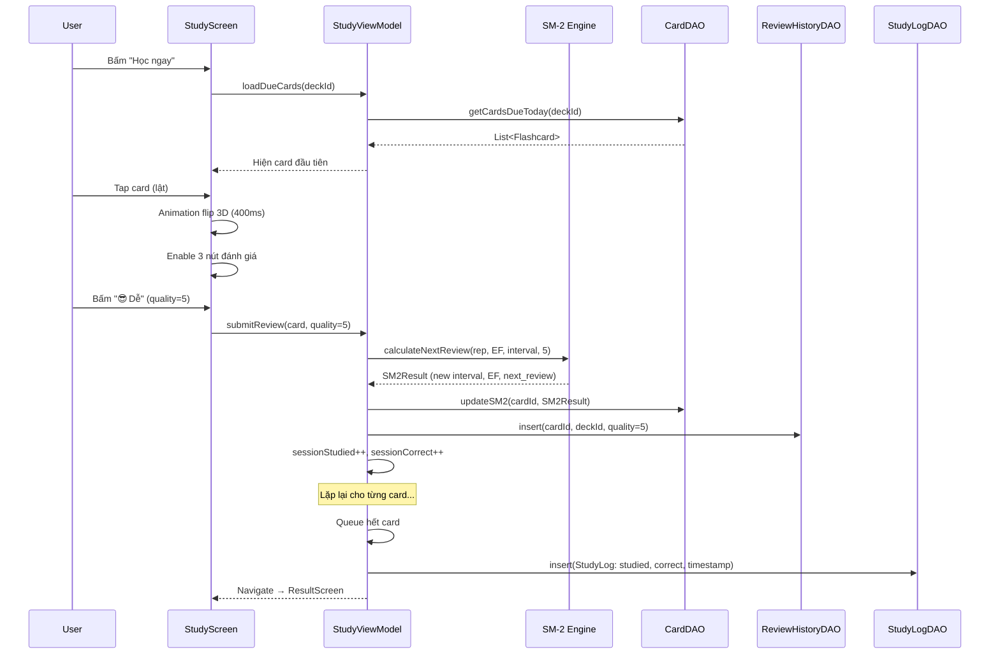
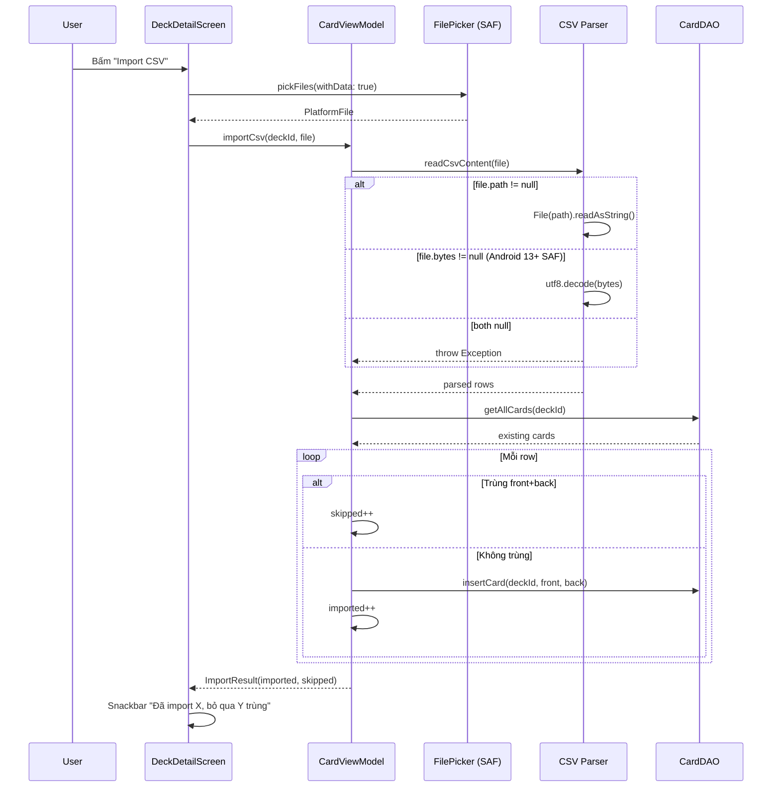
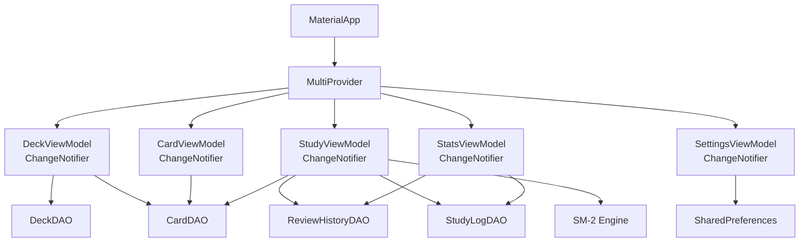

# 🏗️ Tài Liệu Kiến Trúc Hệ Thống — ZenFlashCards

> Tài liệu kỹ thuật mô tả chi tiết kiến trúc phần mềm, các quyết định thiết kế và luồng dữ liệu của ứng dụng ZenFlashCards.

---

## 1. Tổng Quan Kiến Trúc

ZenFlashCards áp dụng mô hình **Clean Architecture** kết hợp **Feature-Driven Structure**, chia thành 3 lớp chính:

### Nguyên Tắc Thiết Kế

| Nguyên tắc | Áp dụng |
|------------|---------|
| **Separation of Concerns** | UI không chứa logic nghiệp vụ; ViewModel không biết về widget |
| **Dependency Injection** | MultiProvider ở root, inject ViewModel vào Screens |
| **Single Source of Truth** | SQLite là nguồn dữ liệu duy nhất; UI chỉ phản ánh state |
| **Offline-First** | 100% dữ liệu lưu local, không phụ thuộc network |
| **Feature Cohesion** | Mỗi feature (home, deck, study...) tự chứa screen + viewmodel |

---

## 2. Luồng Dữ Liệu Chi Tiết

### 2.1. Luồng Study Session (Buổi Học Flashcard)

### 2.2. Luồng Import CSV

---

## 3. State Management

### Provider Architecture

### ViewModel Responsibilities

| ViewModel | Trách nhiệm |
|-----------|-------------|
| `DeckViewModel` | CRUD deck, tính card count động, query cards due today |
| `CardViewModel` | CRUD card, check duplicate mềm, import CSV + dedup |
| `StudyViewModel` | Queue management, SM-2 calculation, review logging, session finalization |
| `StatsViewModel` | Streak calculation, bar chart data (7 ngày), pie chart data (quality breakdown) |
| `SettingsViewModel` | ThemeMode persist/restore qua SharedPreferences |

---

## 4. Quyết Định Kiến Trúc (ADRs)

### ADR-001: Bỏ `card_count` denormalized trong bảng `decks`

- **Quyết định**: Tính `COUNT(*)` động từ bảng `flashcards` thay vì lưu cột `card_count`
- **Lý do**: Tránh dữ liệu lệch (data inconsistency) khi import/delete card
- **Trade-off**: Thêm 1 query nhưng SQLite với index trên `deck_id` rất nhanh (< 1ms)

### ADR-002: Tách `study_logs` và `review_history`

- **Quyết định**: `study_logs` = 1 row/buổi (aggregate), `review_history` = 1 row/lần lật (granular)
- **Lý do**: Bar chart và streak chỉ cần aggregate; Pie chart cần granular quality data
- **Trade-off**: Nhiều row hơn trong `review_history` nhưng SQLite offline xử lý thoải mái

### ADR-003: SAF (Storage Access Framework) cho file picker

- **Quyết định**: Dùng `Intent.ACTION_OPEN_DOCUMENT` qua `file_picker`, không khai báo storage permission
- **Lý do**: Android 13+ scoped storage không cho phép truy cập trực tiếp filesystem; khai báo thừa bị Play Store reject
- **Fallback**: Luôn request `withData: true` để có `PlatformFile.bytes` khi `path == null`

### ADR-004: Provider thay vì Riverpod/Bloc

- **Quyết định**: Dùng Provider (ChangeNotifier) cho state management
- **Lý do**: Đơn giản, ít boilerplate, phù hợp với scope ứng dụng offline nhỏ-vừa
- **Khi nào nâng cấp**: Nếu cần reactive streams hoặc multi-platform sync (v2)

---

## 5. Security & Performance

### Bảo Mật

- **Không lưu dữ liệu nhạy cảm**: App chỉ lưu từ vựng, không có thông tin cá nhân
- **Không cần permission**: Không khai báo storage/camera/location permission
- **SQLite local**: Dữ liệu không rời khỏi thiết bị

### Hiệu Năng

- **Index optimization**: 6 indexes trên các cột query thường xuyên
- **Animation**: 3D flip card chạy trên GPU qua `Transform` matrix, mượt 60fps
- **Memory**: `AnimationController` được dispose đúng lifecycle, không leak
- **Lazy loading**: Cards chỉ load khi user vào deck, không load tất cả upfront
