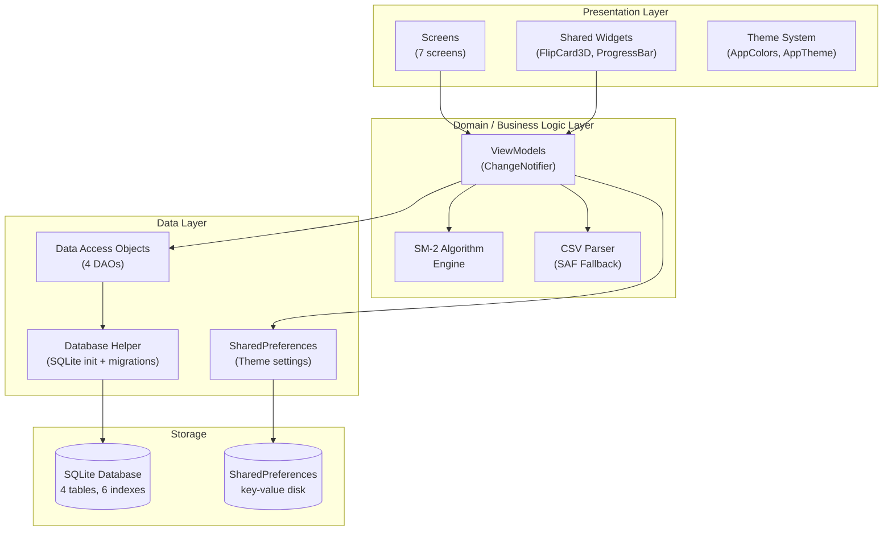
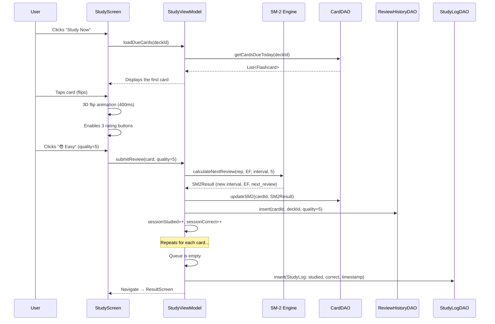
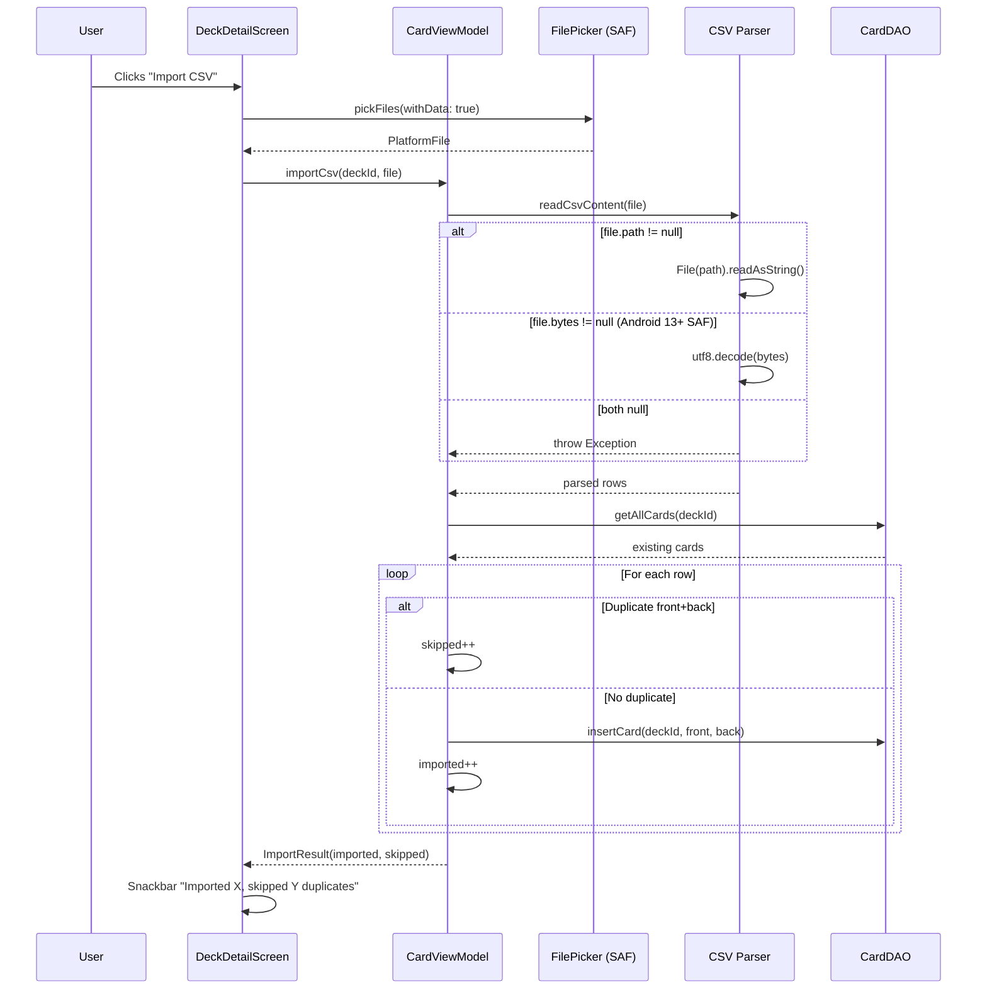
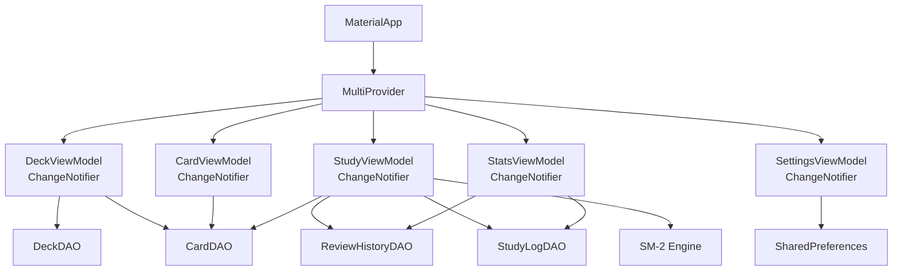

# 🏗️ System Architecture Documentation — ZenFlashCards

> Technical documentation describing the software architecture, design decisions, and data flow of the ZenFlashCards application in detail.

---

## 1. Architectural Overview

ZenFlashCards adopts **Clean Architecture** combined with a **Feature-Driven Structure**, divided into 3 main layers:

### Design Principles

| Principle | Application |
|------------|-------------|
| **Separation of Concerns** | UI does not contain business logic; ViewModel is unaware of widgets |
| **Dependency Injection** | MultiProvider at the root, inject ViewModel into Screens |
| **Single Source of Truth** | SQLite is the sole source of truth; UI only reflects the state |
| **Offline-First** | 100% of data is stored locally, no network dependency |
| **Feature Cohesion** | Each feature (home, deck, study...) is self-contained with screen + viewmodel |

---

## 2. Detailed Data Flow

### 2.1. Study Session Flow

### 2.2. CSV Import Flow

---

## 3. State Management

### Provider Architecture

### ViewModel Responsibilities

| ViewModel | Responsibility |
|-----------|----------------|
| `DeckViewModel` | Deck CRUD, dynamic card count calculation, query cards due today |
| `CardViewModel` | Card CRUD, soft duplicate check, import CSV + deduplicate |
| `StudyViewModel` | Queue management, SM-2 calculation, review logging, session finalization |
| `StatsViewModel` | Streak calculation, bar chart data (7 days), pie chart data (quality breakdown) |
| `SettingsViewModel` | ThemeMode persist/restore via SharedPreferences |

---

## 4. Architecture Decisions (ADRs)

### ADR-001: Drop denormalized `card_count` in `decks` table

- **Decision**: Calculate `COUNT(*)` dynamically from the `flashcards` table instead of storing a `card_count` column.
- **Reason**: Prevents data inconsistency when importing or deleting cards.
- **Trade-off**: Requires an additional query, but SQLite with an index on `deck_id` is very fast (< 1ms).

### ADR-002: Separate `study_logs` and `review_history`

- **Decision**: `study_logs` = 1 row per session (aggregate), `review_history` = 1 row per card flip (granular).
- **Reason**: Bar charts and streaks only need aggregates; pie charts require granular quality data.
- **Trade-off**: Results in more rows in `review_history`, but offline SQLite handles this effortlessly.

### ADR-003: SAF (Storage Access Framework) for file picker

- **Decision**: Use `Intent.ACTION_OPEN_DOCUMENT` via `file_picker`, do not declare storage permissions.
- **Reason**: Android 13+ scoped storage does not allow direct filesystem access; declaring unnecessary permissions will cause rejection by the Play Store.
- **Fallback**: Always request `withData: true` to get `PlatformFile.bytes` when `path == null`.

### ADR-004: Provider instead of Riverpod/Bloc

- **Decision**: Use Provider (ChangeNotifier) for state management.
- **Reason**: Simple, less boilerplate, suitable for the scope of a small-to-medium offline app.
- **When to upgrade**: If reactive streams or multi-platform sync are needed (v2).

---

## 5. Security & Performance

### Security

- **No sensitive data stored**: The app only stores vocabulary, no personal information.
- **No permissions required**: Does not declare storage/camera/location permissions.
- **Local SQLite**: Data never leaves the device.

### Performance

- **Index optimization**: 6 indexes on frequently queried columns.
- **Animation**: 3D flip card runs on the GPU via a `Transform` matrix, smooth 60fps.
- **Memory**: `AnimationController` is disposed properly based on the lifecycle, no leaks.
- **Lazy loading**: Cards are only loaded when the user enters a deck; they are not loaded upfront.
