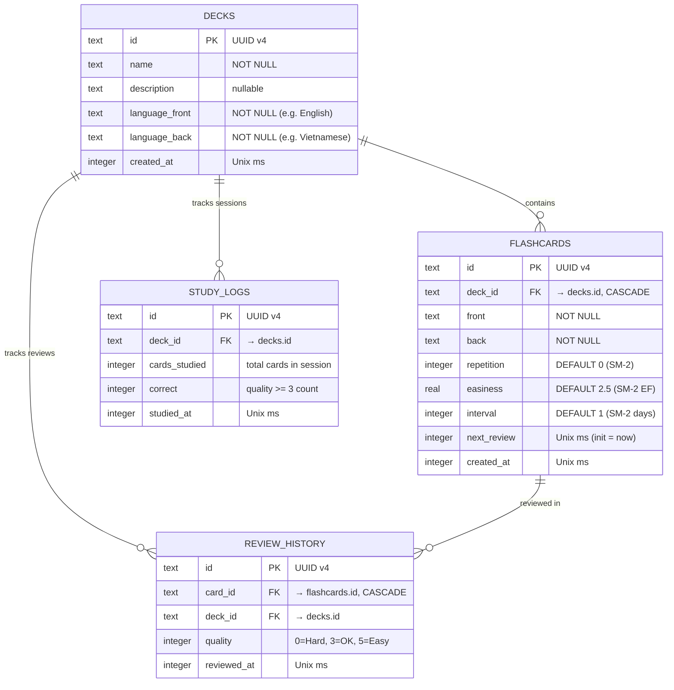

# 🗄️ Database Documentation — ZenFlashCards

> Schema details, indexes, query patterns, and migration strategy for the SQLite database.

---

## 1. Database Overview

| Property | Value |
|-----------|---------|
| Engine | SQLite (via `sqflite` package) |
| Storage | 100% offline, local device |
| Number of Tables | 4 |
| Number of Indexes | 6 |
| ID Strategy | UUID v4 (text) |
| Timestamp | Unix milliseconds (integer) |

---

## 2. Entity Relationship Diagram



---

## 3. Schema DDL

### 3.1. `decks` Table

```sql
CREATE TABLE decks (
  id TEXT PRIMARY KEY,
  name TEXT NOT NULL,
  description TEXT,
  language_front TEXT NOT NULL,
  language_back TEXT NOT NULL,
  created_at INTEGER NOT NULL
);
```

> **Note**: There is no `card_count` column — calculated dynamically using `SELECT COUNT(*) FROM flashcards WHERE deck_id = ?` to prevent data inconsistency.

### 3.2. `flashcards` Table

```sql
CREATE TABLE flashcards (
  id TEXT PRIMARY KEY,
  deck_id TEXT NOT NULL,
  front TEXT NOT NULL,
  back TEXT NOT NULL,
  repetition INTEGER DEFAULT 0,
  easiness REAL DEFAULT 2.5,
  interval INTEGER DEFAULT 1,
  next_review INTEGER NOT NULL,
  created_at INTEGER NOT NULL,
  FOREIGN KEY (deck_id) REFERENCES decks(id) ON DELETE CASCADE
);

CREATE INDEX idx_flashcards_deck ON flashcards(deck_id);
CREATE INDEX idx_flashcards_next_review ON flashcards(next_review);
```

> **Initializing `next_review`**: Set to `DateTime.now().millisecondsSinceEpoch` when creating a new card → card appears immediately in the first review session.

### 3.3. `study_logs` Table

```sql
CREATE TABLE study_logs (
  id TEXT PRIMARY KEY,
  deck_id TEXT NOT NULL,
  cards_studied INTEGER NOT NULL,
  correct INTEGER NOT NULL,
  studied_at INTEGER NOT NULL
);

CREATE INDEX idx_study_logs_date ON study_logs(studied_at);
```

> **Logging Rule**: Only insert **1 row when finishing a study session** (all due cards have been reviewed). Used for the 7-day bar chart and calculating streaks.

### 3.4. `review_history` Table

```sql
CREATE TABLE review_history (
  id TEXT PRIMARY KEY,
  card_id TEXT NOT NULL,
  deck_id TEXT NOT NULL,
  quality INTEGER NOT NULL,
  reviewed_at INTEGER NOT NULL,
  FOREIGN KEY (card_id) REFERENCES flashcards(id) ON DELETE CASCADE
);

CREATE INDEX idx_review_history_card ON review_history(card_id);
CREATE INDEX idx_review_history_deck ON review_history(deck_id);
```

> **Logging Rule**: Insert **1 row every time the user clicks Hard/OK/Easy** for 1 card. Used for the quality breakdown pie chart.

---

## 4. Index Strategy

| Index | Table | Column | Serves Query |
|-------|-------|--------|--------------|
| `idx_flashcards_deck` | flashcards | deck_id | Load cards by deck |
| `idx_flashcards_next_review` | flashcards | next_review | Cards due today (`<= now`) |
| `idx_study_logs_date` | study_logs | studied_at | 7-day bar chart, streak |
| `idx_review_history_card` | review_history | card_id | Review history for 1 card |
| `idx_review_history_deck` | review_history | deck_id | Pie chart by deck |

> **Deferred index**: `idx_review_history_date` on `reviewed_at` will be added in v2 when a heatmap/date-range filter is needed.

---

## 5. Common Query Patterns

### Cards Due Today (For 1 Deck)

```sql
SELECT * FROM flashcards
WHERE deck_id = ? AND next_review <= ?
ORDER BY next_review ASC;
-- ? = deckId, ? = DateTime.now().millisecondsSinceEpoch
```

### Total Cards Due Today (All Decks — Home Badge)

```sql
SELECT COUNT(*) as count FROM flashcards
WHERE next_review <= ?;
```

### Card Count in a Deck

```sql
SELECT COUNT(*) as count FROM flashcards
WHERE deck_id = ?;
```

### Cards Due Per Deck (For Home Screen)

```sql
SELECT deck_id, COUNT(*) as due_count FROM flashcards
WHERE next_review <= ?
GROUP BY deck_id;
```

### Bar Chart — Cards Studied Over 7 Days

```sql
SELECT studied_at, SUM(cards_studied) as total
FROM study_logs
WHERE studied_at >= ?
GROUP BY DATE(studied_at / 1000, 'unixepoch')
ORDER BY studied_at ASC;
-- ? = 7 days ago (milliseconds)
```

### Pie Chart — Quality Distribution By Deck

```sql
SELECT quality, COUNT(*) as count
FROM review_history
WHERE deck_id = ?
GROUP BY quality;
```

### Streak — Consecutive Study Days

```sql
SELECT DISTINCT DATE(studied_at / 1000, 'unixepoch') as study_date
FROM study_logs
ORDER BY study_date DESC;
-- Count consecutive days backwards from today
```

### Check Duplicate Card

```sql
SELECT * FROM flashcards
WHERE deck_id = ? AND LOWER(TRIM(front)) = ? AND LOWER(TRIM(back)) = ?
LIMIT 1;
```

---

## 6. Migration Strategy

### Version 1 (Initial)

Create all 4 tables + 6 indexes as described above.

### Version 2 (Planned)

```sql
-- Add index for date-range queries on review_history
CREATE INDEX idx_review_history_date ON review_history(reviewed_at);

-- If adding TTS functionality
ALTER TABLE flashcards ADD COLUMN audio_url TEXT;
```

### Migration Code Pattern

```dart
await openDatabase(
  path,
  version: 2,
  onCreate: (db, version) async {
    // Create all v2 tables
  },
  onUpgrade: (db, oldVersion, newVersion) async {
    if (oldVersion < 2) {
      await db.execute('CREATE INDEX idx_review_history_date ON review_history(reviewed_at)');
    }
  },
);
```
