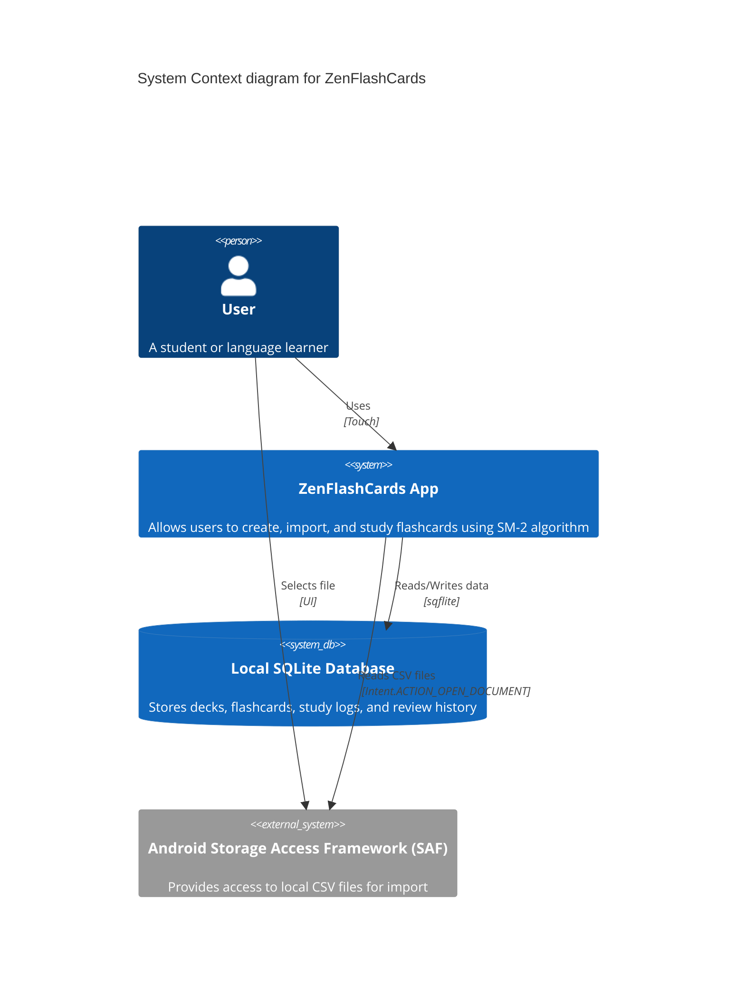
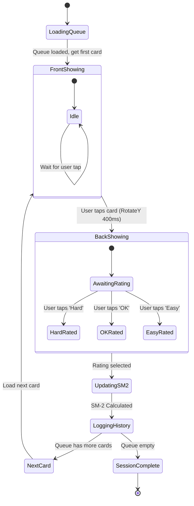
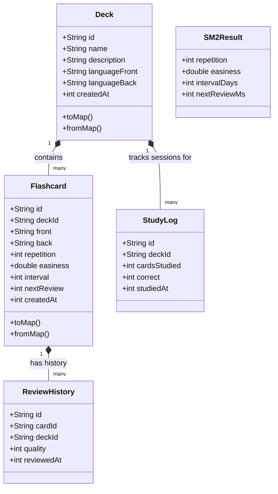
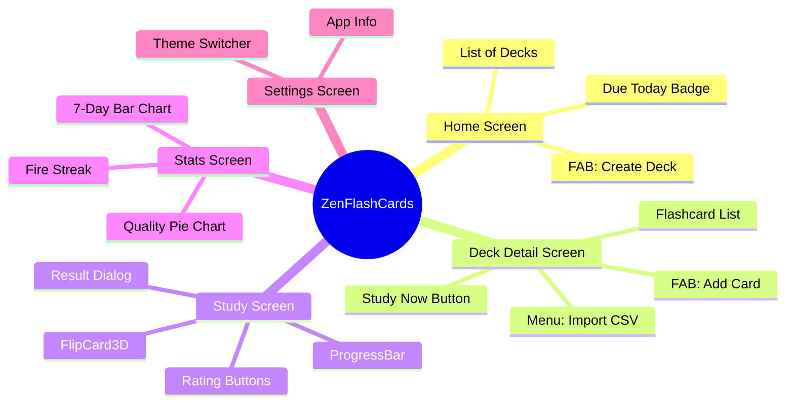

# 📊 System Diagrams — ZenFlashCards

> A comprehensive collection of technical diagrams detailing the system architecture, state machines, user journeys, and data flows.

---

## 1. System Context Diagram (C4 Model - Level 1)

This diagram shows how the user interacts with the ZenFlashCards system and how the system interacts with the local storage.



---

## 2. Flashcard State Machine Diagram

This state machine illustrates the lifecycle of a single flashcard during a study session.



---

## 3. Class Diagram (Domain Models)



---

## 4. Activity Diagram: CSV Import Process

Detailed flow of the CSV Import mechanism, including SAF fallback for Android 13+ and duplicate handling.

```mermaid
actdiag
    actdiag {
      User -> DeckDetail [label = "Tap Import CSV"];
      DeckDetail -> FilePicker [label = "pickFiles(withData: true)"];
      FilePicker -> DeckDetail [label = "Returns PlatformFile"];
      DeckDetail -> CardViewModel [label = "importCsv(file)"];
      
      CardViewModel -> CsvParser [label = "readCsvContent(file)"];
      
      CsvParser -> CsvParser [label = "Check file.path != null"];
      CsvParser -> CsvParser [label = "Check file.bytes != null"];
      
      CsvParser -> CardViewModel [label = "Returns parsed List<CsvRow>"];
      
      CardViewModel -> CardDAO [label = "Fetch existing cards"];
      CardDAO -> CardViewModel [label = "Returns cards"];
      
      CardViewModel -> CardViewModel [label = "Loop through CsvRow"];
      CardViewModel -> CardViewModel [label = "Check if front+back matches"];
      
      CardViewModel -> CardDAO [label = "Insert new cards"];
      
      CardViewModel -> DeckDetail [label = "Returns ImportResult(imported, skipped)"];
      DeckDetail -> User [label = "Show Snackbar"];
    }
```
*(Note: standard activity diagram format for mermaid using flowchart below for better rendering compatibility)*

```mermaid
flowchart TD
    Start([User taps Import CSV]) --> PickFile[FilePicker: pickFiles]
    PickFile --> CheckPath{file.path != null?}
    CheckPath -- Yes --> ReadPath[File(path).readAsString]
    CheckPath -- No --> CheckBytes{file.bytes != null?}
    CheckBytes -- Yes --> ReadBytes[utf8.decode(bytes)]
    CheckBytes -- No --> ThrowErr[Throw Exception]
    
    ReadPath --> ParseCSV[Parse CSV into Rows]
    ReadBytes --> ParseCSV
    
    ParseCSV --> FetchDB[Fetch existing cards from DB]
    FetchDB --> LoopRow[Loop through each CSV Row]
    
    LoopRow --> CheckDup{Is front+back exact match?}
    CheckDup -- Yes --> Skip[skipped++]
    CheckDup -- No --> InsertDB[CardDAO.insertCard] --> Added[imported++]
    
    Skip --> MoreRows{More rows?}
    Added --> MoreRows
    
    MoreRows -- Yes --> LoopRow
    MoreRows -- No --> Finish([Show Snackbar: Imported X, Skipped Y])
```

---

## 5. UI Navigation Map


